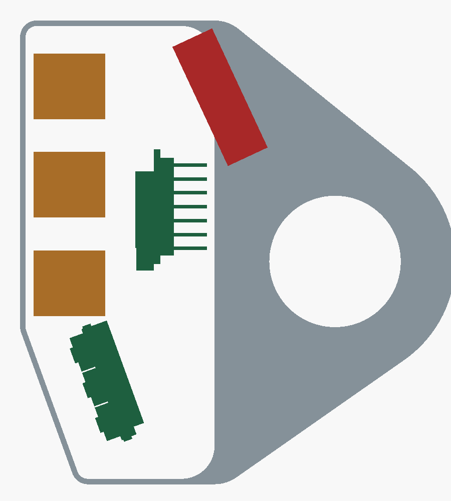
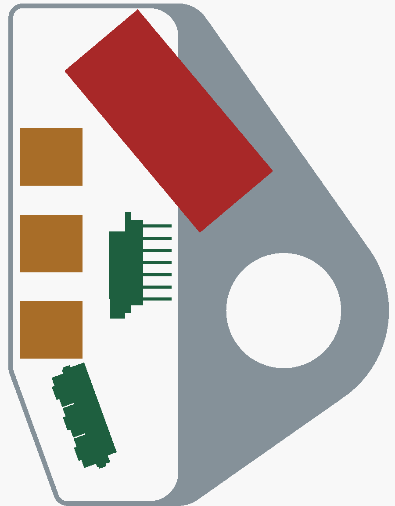

# Battery Power and Removable Remote — Study

This study looks at battery power for the remote and at [issue #1](https://github.com/chirauki/open-rally-remote/issues/1), a removable remote on a fixed handlebar base. It starts from V0.23 ([mechanical notes](mechanical-concept.md), [joystick PCB](../electronics/joystick-pcb/README.md)). No CAD has changed yet; the fits below are 2D checks against the V0.23 geometry.

**Status:** study only. Nothing here has been built or measured.

## Direction chosen

Decided on 2026-10-10, after the first version of this study:
- **The main goal of issue #1 is to share one remote between several bikes.**
- **No wiring to the bike.** The remote runs on its own battery only.
- **Removable remote or swappable battery, not both.** Each one alone solves the battery problem; together they add a second seal, a second wear point and pod length for little gain.
- **Therefore: a removable remote with a fixed LiPo pouch**, on a [bayonet around the bar](#removable-remote-issue-1) with one base per bike. It is charged off the bike through [sealed contacts](#charging-without-bike-wiring) on its back.
- The swappable 16340 is not pursued. Its analysis stays below as the alternative for a remote that stays on one bike.

Next steps wait for parts and measurements; see [Open measurements](#open-measurements).

## Summary

- The V0.23 cavity has no room for a swappable cell. The free spaces are about 14 × 19 × 20.6 mm behind buttons A and B, and a 13 × 26 mm strip (in the plane of the clamp) in the solid shoulder between the cavity and the clamp ring.
- A flat 6 × 20 × 22 mm LiPo, not swappable, fits in V0.23 without growing the housing. It crosses the cavity rear wall into the shoulder. It still fits when the ring keep-out grows by up to 6 mm for the removable remote's saddle.
- A swappable 16340 (RCR123A) cell needs a 20 × 44 mm footprint, including its tube and cap. That fits only if the upper end of the pod grows from 44 to about 64 mm above the bar axis, which makes the pod 20 mm longer.
- The XIAO nRF52840 already has a LiPo charger and battery pads. It cannot take a primary cell (CR2450, CR123A) safely, because it would try to charge it.
- A twist mount like a bike-computer quarter-turn does not suit this remote: the twist would swing the 85 mm pod across the bar into the grip and switchgear. A bayonet that turns around the bar keeps the remote in its 23 mm slot.

## What the XIAO nRF52840 provides

From Seeed's XIAO nRF52840 V1.2 KiCad project, exported to a netlist with KiCad 10:

| Function | Circuit |
|---|---|
| Charger | TI BQ25101 linear charger, from VBUS. ISET is 2.7 kΩ, about 50 mA, with a second 2.7 kΩ to P0.13 (`HICHG`): drive P0.13 low for about 100 mA. Seeed lists 50/100 mA. |
| Battery pads | `BAT` pad, on the BQ25101 output. |
| Power path | A MOSFET (LP0404N3T5G) with its gate on VBUS connects the battery to VIN when VBUS is absent. With VBUS present, VIN comes from VBUS through a Schottky diode (SDM20U40), and the battery only charges. |
| Regulator | SGM2040 3.3 V LDO, 250 mA, from VIN. |
| Battery voltage | 1 MΩ / 510 kΩ divider from VBAT to P0.31 (AIN7), switched by P0.14 (`READ_BAT`, active low). |
| Charge status | BQ25101 `CHG` to P0.17, and a charge LED. |
| 5V header pin | Same net as USB-C VBUS, with nothing between them (see the [joystick PCB notes](../electronics/joystick-pcb/README.md#circuit)). |

Consequences:
- **A rechargeable Li-ion or LiPo cell on the `BAT` pad is charged whenever the 5V pin or USB-C has power.** The charger enable is not wired to a GPIO, so the firmware cannot turn charging off.
- **A primary lithium cell (CR2450, CR2477, CR123A) must not go on the `BAT` pad.** The charger would try to charge it whenever 5 V is present. A coin-cell design like the Remotek One needs its own board without a charger.
- With 5 V present (charge contacts or USB-C), the remote runs from 5 V and charges the cell at the same time.

## Battery options

| Cell | Size | Capacity | Swappable | Fits V0.23 | Pod growth |
|---|---|---|---|---|---|
| LiPo pouch with protection board (for example 602020) | about 6 × 20 × 22 mm | about 180–250 mAh in listings | No | Yes, across the cavity rear wall | None |
| 16340 / RCR123A Li-ion, protected | Ø16.5–17 × 33.8–36 mm | 650–950 mAh in manufacturer listings | Yes | No | Top end 44 → about 64 mm |
| 14250 Li-ion (½ AA) | Ø14–14.5 × 25–26 mm | 300–600 mAh, vendor claims only; no manufacturer datasheet found | Yes | No | Top end 44 → about 56 mm |
| 10440 Li-ion (AAA size) | Ø10.5 × 44.5 mm | about 350 mAh (typical, not verified) | Yes | No | Top end 44 → about 64 mm |
| CR2450 coin cell | Ø24.5 × 5 mm | about 620 mAh (typical, not verified) | Yes | No | Not usable with the XIAO |

The 16340 was the candidate for a swappable cell, before the [direction chosen](#direction-chosen) dropped it:
- **Capacity.** It holds three to four times the energy of the pouch that fits.
- **Supply.** Protected 16340 cells and their chargers are sold for flashlights.
- **Sealing.** A screw cap with an O-ring, as on a flashlight, is a well-proven sealed battery closure.

The 16340 is the same size as the primary CR123A (3 V). A CR123A in the remote would be charged by the XIAO; see [Risks](#risks).

### Fit method

The checks use the V0.23 2D profiles in the plane of the clamp, with these keep-outs:
- a 1 mm outer wall;
- 1.5 mm around the clamp ring;
- the XIAO with its pins and rails;
- the buttons, plus 5 mm behind them for wires;
- everything below the fold.

The cell's footprint, including its tube and cap, is searched over positions and angles in 5° steps. The cell's diameter runs along the bar. A 17–20 mm tube fits in the 23 mm width, leaving 1.5–3 mm of wall on each side.

For the removable remote, the same search was rerun with the ring keep-out grown to leave room for a saddle around the ring:

| Extra radial keep-out around the ring | 8 × 24 mm (6 mm pouch) | 10 × 24 mm (8 mm pouch, same outline) | 8 × 34 mm or longer |
|---|---|---|---|
| 0 mm (V0.23) | Fits, at −65° | Fits, at −60° | No fit |
| 4 mm | Fits, at −45° | Fits, at −25° | No fit |
| 6 mm | Fits, at −20° | Not checked | Not checked |

An 8 mm thick pouch of the same 20 × 22 mm outline would hold more charge; its capacity has not been checked against a listing. A pouch longer than about 25 mm does not fit above the fold. The pouch is 20 mm along the bar, inside the 21 mm cavity of the 23 mm part.

The 16340 tube runs diagonally, at 50° to the bar-to-cover direction, from the top of the cavity into the upper shoulder. The cap end can open on the shoulder face, where it can be reached with the remote on the bar. Growing the top end by 20 mm has not been checked against the bike: mirrors, brake reservoir and switchgear. It needs measuring before CAD work.

## Power architecture

Two ways to connect the cell:

| | A: cell on the XIAO `BAT` pad | B: cell into the 5V pin through a diode |
|---|---|---|
| Charging | On board, at 50 or 100 mA, from the charge contacts or USB-C; a 16340 could also go in an external charger | External charger only |
| Voltage loss | Only the MOSFET | Two Schottky drops, ours and the XIAO's (about 0.4–0.6 V together). At 3.0 V the 3.3 V rail falls to about 2.5 V. |
| Primary CR123A | Unsafe: it gets charged | Allowed, but only with a diode that blocks any charge current |
| Battery voltage reading | Built-in divider on AIN7 | Needs a divider on another pin |

**Recommendation: A, with rechargeable cells only.** It needs no extra parts and keeps the full voltage. A 250 mAh pouch takes about 5 h at 50 mA or 2.5 h at 100 mA; a 900 mAh 16340 would take about 18 h or 9 h.

The 100 mA rate should be checked against the cell's maximum charge current. The listings above do not all give a maximum charge current; check the chosen cell's datasheet.

## Runtime estimate

There is no measurement on this firmware yet; the BLE current of the XIAO with Bluefruit is the main unknown. The published figures found:
- XIAO with Arduino/Bluefruit sleep: about 22 µA, measured by a forum user.
- System OFF: 2–3 µA.
- An nRF52840 connected over BLE: from about 0.2 mA (power-profiler estimate at a 40 ms interval) to about 1 mA (a forum report).

| Average current | 250 mAh pouch | 900 mAh 16340 |
|---|---|---|
| 1 mA (connected, short interval) | 10 days | 37 days |
| 0.3 mA (connected, with peripheral latency) | 35 days | 125 days |

These are continuous-connection figures. With the firmware sleeping while the bike is parked and reconnecting on a press, the runtime would be much longer. Measure before choosing a cell; see [Firmware](#firmware).

## Sealing

| Opening | Seal | Risk |
|---|---|---|
| Battery tube cap (new) | Radial O-ring on a smooth land inside the tube mouth, not on the thread | An FDM bore is rough and slightly oval; the land may need reaming, a glued-in sleeve, or a printed and sanded land. Measure leakage on a test piece. |
| Cap electrical contact | Spring in the cap on the cell's negative end, closing through a contact ring at the tube mouth inside the O-ring | The contact and its wire stay inside the seal. Contacts corrode if water gets past the O-ring. |
| Cable gland (current) | Unchanged, if the cable stays | — |

The tube is a separate sealed volume from the electronics cavity. Only two wires pass from the tube into the cavity, sealed when printed or potted. A leak at the cap then wets the cell and its contacts, not the boards.

## Removable remote (issue #1)

A concept, not yet modelled. The goal is to move one remote between bikes without tools. Each bike keeps its own base.

### Split

- **Base.** A clamp ring that stays on the bar, with two halves and two M4 bolts as now. It has no electronics. A base for each bike can be sized to that bike's bar.
- **Remote.** The pod, the two shoulders, the XIAO, the joystick PCB and the LiPo pouch. Its back is a saddle around the front of the base ring.

### Why a bayonet around the bar

A twist mount turns the device about an axis normal to its mating face. On this remote that face lies between the ring and the pod, so the axis is in the plane of the clamp. A quarter turn about it swings the pod's 85 mm length across the bar, into the grip, levers and switchgear, where the manual gives only 23 mm of free bar.

A dovetail sliding in the plane of the clamp avoids that sweep. It needs a flat platform on the round ring, which adds material and pushes the pod away from the bar.

A bayonet that turns around the bar axis keeps the remote in its 23 mm slot, uses the round ring directly, and stays in the plane the pod already occupies.

### Bayonet

- **Base.** The ring carries two short circumferential lugs on its outer surface.
- **Remote.** The saddle has a matching inner groove with an entry gap for each lug. It wraps no more than 180°, so it can go on over the ring from the front.
- **Fitting.** Offer the remote to the ring turned by an entry angle, with the lugs in the gaps. Push it home and turn it about the bar to its working position. The lugs slide under the groove lips, which hold the remote against pull-off.
- **Stops.** A hard stop ends the turn. A steel spring plunger in the saddle drops into a notch in the ring and stops it turning back. A printed spring would wear and creep, so the spring must be steel.
- **Release.** Pull the plunger knob and turn the remote back to the entry angle.
- **Tether.** A short lanyard from the remote to the base or the bar keeps a remote that comes loose off the trail.

### Loads

Button presses and joystick pushes make a torque about the bar axis:
- Buttons A and B are on one side of the bar axis, at Y = 32 and 14 mm.
- Button C (Y = −4 mm) and the joystick, below the fold, are on the other side.

So presses load the bayonet in both directions. Put the hard stop on the side of A and B, the most used buttons. The plunger then takes the torque from the joystick and button C, plus shocks and vibration. Size the plunger force and the notch angle for that, and test both off the bike before riding.

Pull-off loads go into the lugs and groove lips. Their strength in printed PETG or ASA has not been checked. Layer direction matters: the lips should not split along a layer line.

### Geometry to check in CAD

- **Radial build.** Today the clamp ring is 10 mm thick, from the Ø24 mm bore to Ø44 mm. Either the base ring stays at Ø44 mm and the saddle sits outside it, or the ring gets thinner and the saddle takes part of its section.
  - **Saddle outside a Ø44 mm ring.** The pod moves out by the saddle thickness (about 3–4 mm). That changes reach to the turn-signal switch, which set the 20° fold. The pouch still fits; see [Fit method](#fit-method).
  - **Thinner ring.** The clamp loses section, and its strength is not validated even now.
- **Width.** Lugs, groove and plunger must stay inside 23 mm along the bar.
- **Entry angle.** The remote turns through the entry angle near the brake lever, reservoir and mirror. A small angle (20–30°) sweeps less but gives shorter lugs. Check the sweep on each bike.
- **Angle setting.** Today the rider sets the pod angle by turning the clamp before tightening. With a base, the angle is set by turning the base before tightening; the bayonet then always returns to the same angle.

## Charging without bike wiring

The remote is charged off the bike. The XIAO USB-C socket is inside the pod and can only be reached with the cover off, which disturbs the gasket. It stays for firmware recovery only.

- **Charge contacts.** Two pads or a 2-pin magnetic pogo connector on the remote's back, inside the saddle. They are wired to the joystick PCB 5 V input and GND in place of the bike cable, so they go through its TVS diode and PTC fuse to the XIAO 5V pin.
- **Covered when mounted.** On the base the contacts face the ring, out of the rain and mud.
- **Dead when off the charger.** The XIAO feeds VIN from VBUS through a Schottky diode, and the battery reaches VIN through the power-path MOSFET. Neither path drives VBUS, so the pads carry no voltage when the remote runs on its battery. They cannot corrode from bias, and shorting them does no harm. This comes from the netlist and has not been measured.
- **Charger.** A matching magnetic USB cable, or a small charging dock printed to the saddle shape with two spring pins.
- **No cable gland.** The bike cable goes, so the gland and its lock nut go too. The gland lock nut set the 20° fold limit. The freed space at the bottom of the pod has not been searched for a larger cell.

Points to solve:
- **Sealing.** The pads or connector are a new sealed feature on the remote's back wall. Moulded-in pads or a connector with its own seal, potted from inside.
- **Reverse polarity.** A magnetic connector is keyed; bare pads are not. On the joystick PCB a reversed supply makes the TVS diode D1 conduct and the PTC fuse F1 trip ([joystick PCB notes](../electronics/joystick-pcb/README.md#circuit)). So a reversed charger should not reach the XIAO, but it heats D1 and F1 until it is removed. Prefer a keyed connector or a keyed dock.
- **USB-C and pads together.** Both are the XIAO VBUS net. Do not connect both at once; with the cover off on the bench this is the user's care.

## Open measurements

Before any CAD work, with the parts in hand:
1. **Current.** Average current of the XIAO with this firmware, connected over BLE and idle, with a multimeter in series on the battery lead. It decides whether a 250 mAh pouch is enough.
2. **Bars.** Bar diameter at the mounting point on each bike.
3. **Sweep.** Free space around the mounting point on each bike for the remote turning through the entry angle: brake lever, reservoir, mirror and switchgear.
4. **Pouch.** The chosen pouch's real thickness, outline and protection board, and its maximum charge current against the XIAO's 50 or 100 mA.

## Firmware

- **Battery level.** Read AIN7 with P0.14 low. Report it over the BLE Battery Service; Bluefruit has `BLEBas`. Warn below about 3.5 V. Go to System OFF below about 3.3 V, ahead of the cell's protection cut-off.
- **Charging.** Read P0.17 (`CHG`). Drive P0.13 low for 100 mA only if the cell allows it.
- **Charger present.** The nRF52840 VBUS pin is on the same net as the 5V pin. Its USB power events can tell the firmware that the charge contacts are powered, for example to show charging or to stop advertising while on the charger.
- **Sleep and wake.** When parked, or idle for a set time, go to System OFF and wake on any button or joystick switch through GPIO sense. Measure how long a bonded phone takes to reconnect, and whether the first press after wake is lost.
- **Connection parameters.** Measure average current against connection interval and peripheral latency, against the input delay the rider notices.

## Risks

- **Primary CR123A in the 16340 tube.** It is the same size as the RCR123A, and with architecture A the XIAO would charge it whenever 5 V is present. Charging a primary lithium cell can make it vent or catch fire. Mark the tube "Li-ion 3.7 V only", and document it in the assembly and user notes. There is no electrical way to refuse a CR123A with architecture A.
- **Unprotected cells.** The BQ25101 is a charger, not a protection circuit. Use protected 16340 cells only.
- **Heat.** A black remote in the sun can pass 45 °C, the usual maximum for charging Li-ion. The BQ25101 TS input is fixed by a resistor on the XIAO, so the XIAO has no cell temperature cut-off. Check the cell's charge temperature range.

With the fixed pouch chosen, the CR123A risk goes away: the pouch is soldered in and nobody can swap it for a primary cell. It applies again only if the 16340 alternative is taken up.

## Decisions

Made:
1. Removable remote with a fixed LiPo pouch; no swappable cell.
2. Architecture A: the pouch on the XIAO `BAT` pad, charged on board.
3. No bike wiring and no base contacts. The base is mechanical only.

Still open, after the [measurements](#open-measurements):
1. Pouch size: 6 mm or 8 mm thick.
2. Saddle outside the Ø44 mm ring, or a thinner ring.
3. Bare pads or a magnetic connector for charging.

## Sources

- Seeed XIAO nRF52840 [wiki](https://wiki.seeedstudio.com/XIAO_BLE/) and [V1.2 KiCad project](https://files.seeedstudio.com/wiki/XIAO-BLE/Res/260828_Seeed_Studio_XIAO_nRF52840_v1.2.zip) (charger, power path, divider and pin nets).
- 16340 cells:
  - [Keeppower ICR16340 datasheet (NKON)](https://www.nkon.nl/en/amfile/file/download/file/138/product/4135);
  - [Keeppower RCR123A 950 mAh](https://illumn.com/16340-keeppower-950mah-rcr123a2-protected-button-top.html);
  - [Nitecore NL169](https://www.batteryjunction.com/nitecore-nl169);
  - [Olight 16340 test](https://budgetlightforum.com/t/test-review-of-olight-16340-rcr123a-650mah-cyan/38182).
- 14250 cells:
  - [1/2 AA vs 14250](https://batteryequivalents.com/1-2-aa-battery-vs-14250-battery.html);
  - [14250 3.7 V listing](https://makerselectronics.com/product/rechargeable-li-ion-battery-14250-1-2-aa-3-7v-600mah/).
- LiPo pouch listings:
  - [502030, 250 mAh](https://probots.co.in/3-7v-250mah-lipo-battery-502030-open-ended.html);
  - [402025, 150 mAh](https://probots.co.in/3-7v-150mah-lipo-battery-402025-open-ended.html).
- Current figures:
  - [XIAO BLE drawing 570 µA with Zephyr (Nordic DevZone)](https://devzone.nordicsemi.com/f/nordic-q-a/97377/xiao-ble-drawing-570ua-with-zephyr);
  - [nRF52840 battery life estimation (Nordic DevZone)](https://devzone.nordicsemi.com/f/nordic-q-a/63521/nrf52840-battery-life-estimation);
  - [Current consumption for BLE nRF52840 (Nordic DevZone)](https://devzone.nordicsemi.com/f/nordic-q-a/122135/current-consumption-for-ble-nrf52840);
  - [Zephyr XIAO nRF52840 low power](https://github.com/qarnet/Zephyr-XIAO-nRF52840-Ultra-Low-Power).
- [Remotek One](https://www.remotek.no/product-page/remote1) (CR2450, "will last for years"; no current or interval published).
