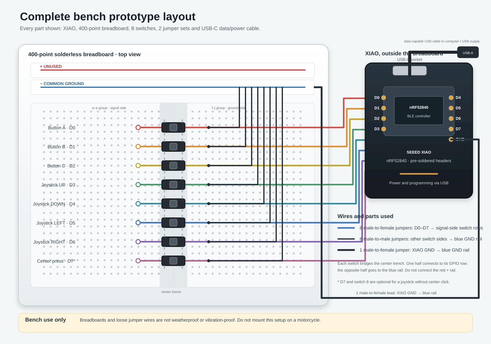

# XIAO nRF52840 Breadboard Assembly

**Status:** bench prototype instructions. This temporary switch fixture is for firmware and BLE experiments; it is not a riding-ready remote.

This guide uses a Seeed XIAO nRF52840 and eight momentary switches to represent the three buttons and a joystick with four directions and an optional center press. It keeps the XIAO off the breadboard and connects it with Dupont leads. Power and programming come from the XIAO's USB-C connector.

## Parts and Spain purchase options

Prices and stock were checked on 2026-10-07. The list is consolidated into two shops: Kiwi Electronics for the XIAO and Conectrol for the remaining parts. Prices include VAT where the shop displays it, but exclude shipping. Stock and delivery charges can change.

| Qty | Part | Example purchase | Price checked | Notes |
|---:|---|---|---:|---|
| 1 | Seeed XIAO nRF52840, standard pre-soldered model (MPN `102010631`) | [Kiwi Electronics](https://www.kiwi-electronics.com/en/seeed-studio-xiao-nrf52840-pre-soldered-20402) | €9.99 before VAT; approx. €12.09 with Spain's 21% VAT | This is the board purchased for this prototype. It has headers already soldered and is the non-Sense model. The product page showed stock when checked. |
| 1 | 400-point solderless breadboard | [Conectrol](https://conectrol.com/producto/placa-protoboard-400-puntos-84x55x85mm/) | €2.00 | Includes side power rails. |
| 1 set | 40 Dupont jumper wires, male-to-female, 20 cm | [Conectrol](https://conectrol.com/producto/kit-cables-dupont-1p-para-protoboard-m-h-40-unds/) | €3.00 | Use at least nine: eight GPIO signals and one XIAO GND lead. Female ends fit the XIAO headers; male ends fit the breadboard. |
| 1 set | 65 Dupont jumper wires, male-to-male | [Conectrol](https://conectrol.com/producto/kit-cables-dupont-1p-para-protoboard-m-m-65-unds/) | €3.00 | Use eight to connect the switches' ground-side rows to the blue rail. |
| 8 | 6×6×5 mm normally-open tactile switch | [Conectrol](https://conectrol.com/producto/pulsador-tactil-off-on-no-6x6x5mm-pcb-rojo/) | €0.20 each; €1.60 total | Three buttons, four joystick directions, and one center press. These tiny switches are only bench stand-ins. |
| 1 | USB-A to USB-C data cable, 1 m | [Conectrol](https://conectrol.com/producto/cable-usb-3-0-tipo-a-usb-tipo-c-3-1-m-m-1mt/) | €6.90 | Optional if you already have a data-capable cable. A charge-only cable will not allow programming. |

**Estimated parts total:** approx. €21.69 without a USB cable, or €28.59 with the listed cable, before shipping. The XIAO total uses the seller's €9.99 pre-tax listing plus an estimated 21% Spanish VAT; confirm the final tax and shipping at checkout. The parts are available from two shops. For a lower-cost alternative, the unheadered standard XIAO (MPN `102010448`) was listed at €9.56 including VAT by [Reichelt Spain](https://www.reichelt.com/es/es/shop/producto/xiao_nrf52840_bt5_0_sin_cabezal-358357); it would need 2×7 2.54 mm headers soldered on, available from Conectrol.

## Tools

- Soldering iron and solder, only if using the unheadered board alternative.
- Small side cutters to cut pin strips, only if using that alternative.
- A USB data cable and a computer for programming.
- Optional multimeter to identify which two switch legs form each electrical side.

## Pin assignment

The firmware should configure these GPIOs as inputs with internal pull-ups. Each switch closes its GPIO to ground when pressed, so the released state reads HIGH and the pressed state reads LOW.

| XIAO pin | Breadboard switch | Function |
|---|---|---|
| D0 | SW1 | Button A |
| D1 | SW2 | Button B |
| D2 | SW3 | Button C |
| D3 | SW4 | Joystick up |
| D4 | SW5 | Joystick down |
| D5 | SW6 | Joystick left |
| D6 | SW7 | Joystick right |
| D7 | SW8 | Joystick center press (optional) |
| GND | Blue/negative rail | Shared switch ground |

If building the joystick-without-center variant, leave D7 disconnected and disable that input in firmware. No 3.3 V or 5 V rail connection is needed for this switch circuit.

## Breadboard wiring diagram

Keep the XIAO beside the breadboard rather than forcing the small board into it. Each switch straddles the breadboard's center trench. One electrical side goes to its GPIO row; the other side goes to the blue ground rail. On a standard breadboard, the five holes on each side of a numbered row are connected together, but the two groups across the center trench are separate.



```text
XIAO nRF52840 (kept beside the breadboard)
  D0 ───────────────────────────────────────────────────────┐
  D1 ────────────────────────────────────────────────────┐  │
  D2 ─────────────────────────────────────────────────┐  │  │
  D3 ──────────────────────────────────────────────┐  │  │  │
  D4 ───────────────────────────────────────────┐  │  │  │  │
  D5 ────────────────────────────────────────┐  │  │  │  │  │
  D6 ─────────────────────────────────────┐  │  │  │  │  │  │
  D7 ──────────────────────────────────┐  │  │  │  │  │  │  │
 GND ──────────────────────────────────┼──┼──┼──┼──┼──┼──┼──┼──── blue (−) rail

Breadboard rows (switches straddle the center trench):
                       a b c d e  ║  f g h i j
 Button A / D0 row:    GPIO ──────║───o/ o─────── GND ─── blue (−)
 Button B / D1 row:    GPIO ──────║───o/ o─────── GND ─── blue (−)
 Button C / D2 row:    GPIO ──────║───o/ o─────── GND ─── blue (−)
 Joystick UP / D3:     GPIO ──────║───o/ o─────── GND ─── blue (−)
 Joystick DOWN / D4:   GPIO ──────║───o/ o─────── GND ─── blue (−)
 Joystick LEFT / D5:   GPIO ──────║───o/ o─────── GND ─── blue (−)
 Joystick RIGHT / D6:  GPIO ──────║───o/ o─────── GND ─── blue (−)
 Center press / D7:    GPIO ──────║───o/ o─────── GND ─── blue (−)
                                     switch

USB-C on XIAO ── data cable ── computer / USB supply
```

The diagram is logical: place the eight switches in separate numbered rows and connect each switch's opposite side to the ground rail. The two five-hole groups in each row (a–e and f–j) are not connected across the center trench. Switch leg layout can vary, so check the switch drawing or use continuity mode to identify the internally joined pairs before wiring.

### Wiring steps

1. **Fit the headers.** Solder one 1×7 male header to each long edge of the XIAO, with the pins projecting downward. Avoid solder bridges between adjacent pads. If using a pre-soldered board, skip this step.
2. **Place the switches.** Insert all eight tactile switches across the breadboard's center trench, each on its own row. Keep them spaced and label the rows A, B, C, UP, DOWN, LEFT, RIGHT, and CENTER.
3. **Connect ground.** Use one jumper from a XIAO GND pin to the breadboard's blue/negative rail. If the rail is split halfway along its length, bridge the two rail sections with another jumper.
4. **Connect the GPIO leads.** Use eight male-to-female leads to connect D0 through D7 to one electrical side of the corresponding switch. Use the pin map above. D7 is optional.
5. **Ground the other switch side.** Use eight male-to-male leads to connect the opposite electrical side of each switch to the blue ground rail. Connect the XIAO GND pin to that rail with a separate male-to-female lead.
6. **Inspect before power.** Check that no GPIO row is accidentally connected to the red rail. Check that the switch legs span the trench and that each GPIO and ground wire reaches opposite electrical sides of its switch.
7. **Power over USB.** Connect the XIAO's USB-C port to a computer or USB supply using a data-capable cable when programming. Do not feed 5 V into a GPIO, and do not connect a second supply to the breadboard while USB is connected.

## Scope and limitations

This assembly is intended for a desk or bench. Solderless breadboards, exposed Dupont leads, and small tactile switches are not vibration-proof, weatherproof, or glove-friendly. Do not mount or use this prototype on a moving motorcycle. The fixture tests button input and firmware behavior; it does not prove the final joystick mechanism, enclosure, USB power protection, or Android/iOS app compatibility.

## References

- [Seeed XIAO nRF52840 documentation: pinout, power, and board details](https://wiki.seeedstudio.com/XIAO_BLE/)
- [Seeed XIAO nRF52840 product page](https://www.seeedstudio.com/Seeed-XIAO-BLE-nRF52840-p-5201.html)
- [Kiwi Electronics: the pre-soldered XIAO nRF52840 purchased for this prototype](https://www.kiwi-electronics.com/en/seeed-studio-xiao-nrf52840-pre-soldered-20402)
- [Reichelt Spain: lower-cost XIAO nRF52840 without headers](https://www.reichelt.com/es/es/shop/producto/xiao_nrf52840_bt5_0_sin_cabezal-358357)
- [Conectrol: 40-pin male header strip for the unheadered-board alternative](https://conectrol.com/producto/tira-de-pines-macho-40p-2-54mm-1-fila-plano-recto-pcb-2/)
- [Conectrol: 400-point breadboard](https://conectrol.com/producto/placa-protoboard-400-puntos-84x55x85mm/)
- [Conectrol: male-to-female Dupont jumper set](https://conectrol.com/producto/kit-cables-dupont-1p-para-protoboard-m-h-40-unds/)
- [Conectrol: male-to-male Dupont jumper set](https://conectrol.com/producto/kit-cables-dupont-1p-para-protoboard-m-m-65-unds/)
- [Conectrol: 6×6×5 mm tactile switch](https://conectrol.com/producto/pulsador-tactil-off-on-no-6x6x5mm-pcb-rojo/)
- [Conectrol: USB-A to USB-C data cable](https://conectrol.com/producto/cable-usb-3-0-tipo-a-usb-tipo-c-3-1-m-m-1mt/)
