# Complete Mechanical CAD — V0.23 Joystick PCB

V0.23 fits the V0.22 joystick to a real PCB, now designed in KiCad: the [joystick PCB](../electronics/joystick-pcb/README.md) carries the four switches and the 5 V input protection. The housing, cover, gasket, stick and knob are unchanged from V0.22; the joystick plate's standoffs moved. The changes are listed under [Changes from V0.22](#changes-from-v022).

V0.22 put a joystick back on the lower facet, built from low-cost parts, and widened the control end of the pod from 23 to 26 mm. The clamp ring and the rear of the pod stay 23 mm wide along the bar.

The joystick is a steel pin with a printed ball. The ball pivots against a seat in a printed joystick plate. Under the ball, a cross-shaped disc rests on four C&K KSC2 sealed tact switches, whose springs centre the stick. Tilting the stick presses one switch; pushing it straight in presses all four, which the firmware reads as the centre press. The parts cost a few euros. The Ruffy MHS of V0.20 was listed at about £149, and the APEM NV, the closest commercial alternative found, at $143.

All printed housing parts are still slices of one outer solid: the convex hull of the pod outline and the Ø44 mm clamp circle, 23 mm wide along the bar, plus the 26 mm control end. Offsets of the folded front cut the cover and gasket from it; the diametral clamp split cuts the cap. Supplier and purchase unknowns remain open and are listed at the end; they are marked `MEASURE` in the CAD.

The remote mounts on the left side of the bar only, never the right. The turn-signal switch that the folded front clears is on the left switchgear.

**Current parametric concept:** [complete-remote-v0.23.scad](../mechanical/cad/complete-remote-v0.23.scad)

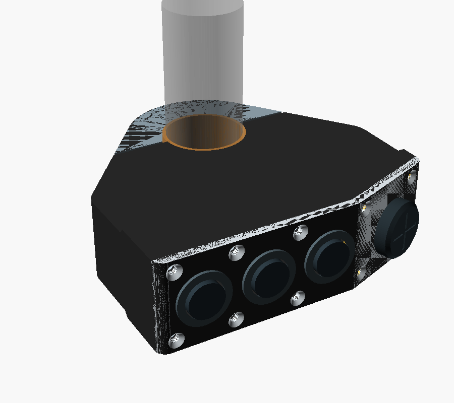

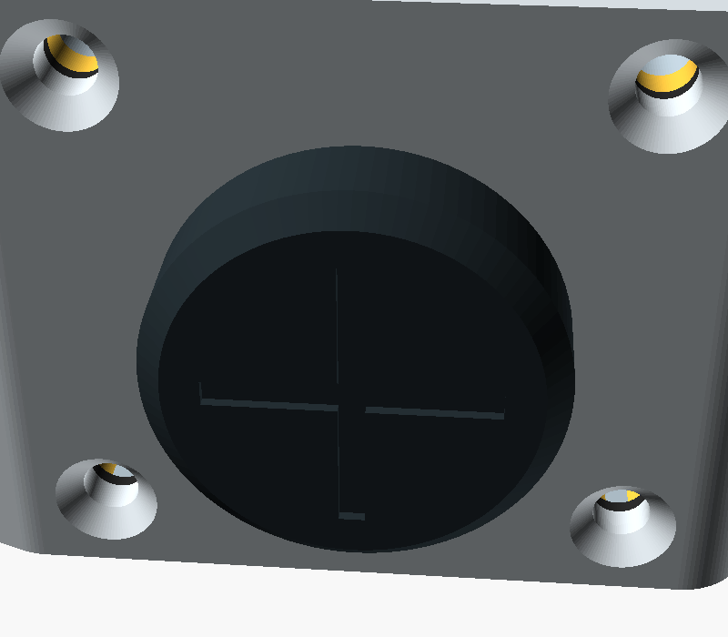

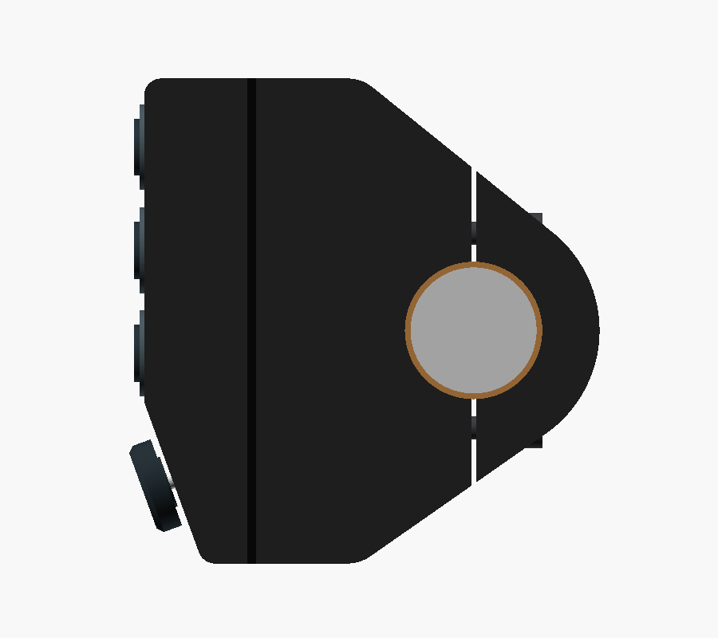

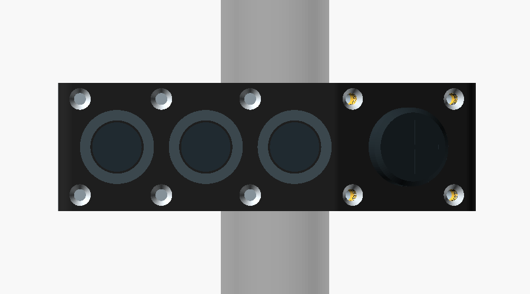

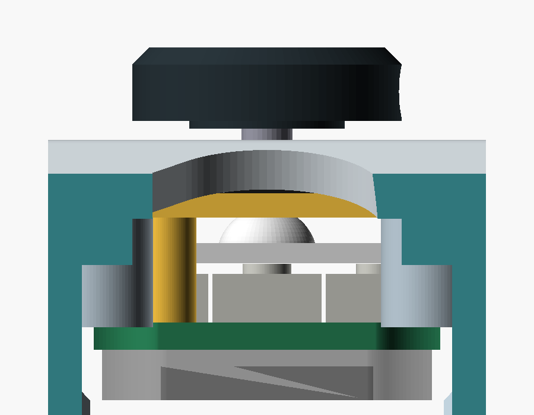

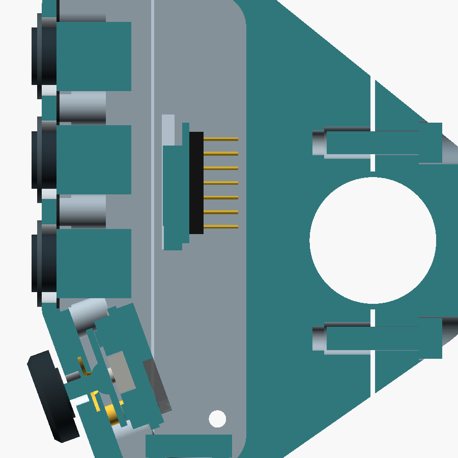

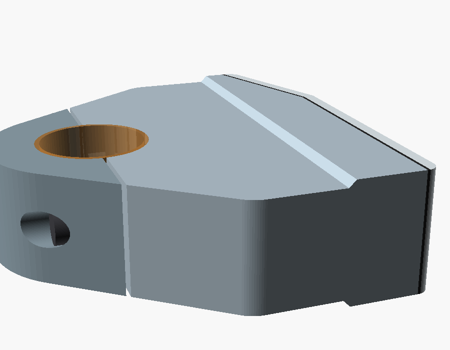

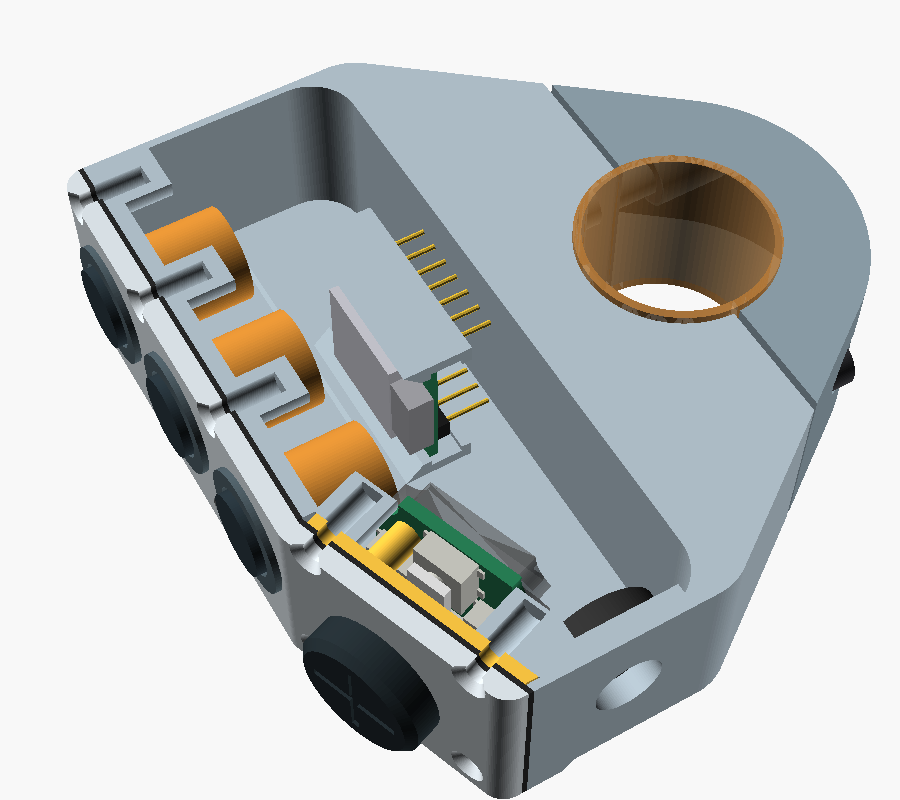

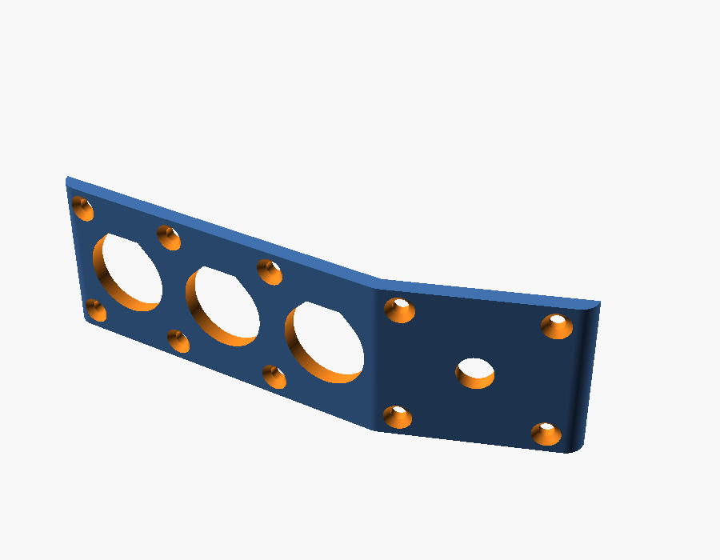

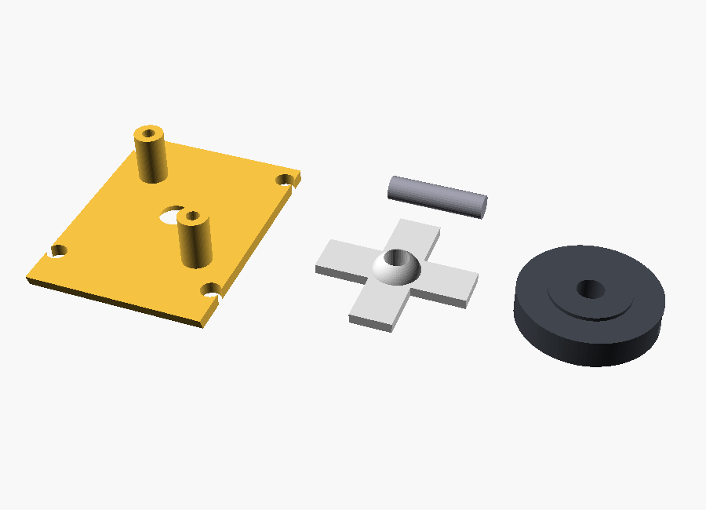

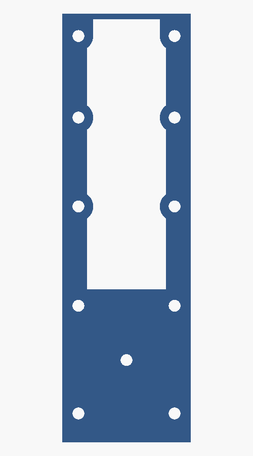

All images are direct OpenSCAD renders of the V0.23 file. The PCB images are on the [joystick PCB page](../electronics/joystick-pcb/README.md).

## Changes from V0.22

The LCSC land pattern for the KSC222JLFS (C221728) puts its pads 0.95 mm outside the switch body, on two opposite sides. The V0.22 layout had not allowed for that.
- **Switch orientation.** All four switches turn 90°. The pad rows of the up and down switches run along the facet; those of the two bar-axis switches run across it. The nearest pads of neighbouring switches are then 1.55 mm apart.
- **Standoffs.** They move from (∓5.6, ±5.4) to (∓6.0, ±6.4) mm in the joystick frame, 0.55 mm clear of the switch pads.
- **PCB outline.** A 20.6 × 22.4 mm rectangle with a 3.3 mm radius notch around each lower cover-screw boss. The boss ends reach 0.25 mm past the PCB front face, so the board must clear them. The CAD and the KiCad board use the same numbers.
- **Rear zone.** 1.0 mm behind the whole board for solder joints, vias and screw heads, and 3.0 mm in the upper half and in the two side strips for the TVS diode (2.45 mm maximum), the PTC fuse and the soldered wires. The lower middle stays at 1.0 mm because a USB-C plug in the XIAO passes close behind it when the cover is off.
- **PCB screws.** M2 × 8 button heads, at most Ø3.5 × 1.1 mm. A pan head (1.6 mm) would touch the 12 mm wide USB-C overmold envelope with the cover off.
- **Power input.** The supply cable now goes to the joystick PCB, through a PTC fuse and a TVS diode, and the PCB feeds the XIAO's 5V pin.
- **Firmware.** The specification now describes the four-switch chord as the centre press; D7 is unused. The diagnostic sketch implements the chord; a separate centre switch on D7 remains as a build option for the breadboard.

## V0.22 changes from V0.21, still current

V0.21 replaced the joystick with four Ø7 mm keys. That direction was dropped, for three reasons:
- Ø7 mm keys with 1.6 mm between them are too small for gloves; a reference guideline asks for at least Ø10 mm for a bare fingertip.
- On the 20° lower facet, flat keys are hard to see, and the thumb has to press them from below.
- A joystick sticks out and is pushed sideways, so it works on that facet.

V0.22 keeps from V0.21 the sheet gasket and the plate that clamps it, and replaces the keys with a joystick.

- **Joystick mechanism.** In the joystick frame, from the outside in:
  - A Ø16 mm knob stands 5.5 mm proud. A Ø9.2 mm hub on its underside is 0.7 mm above the cover; its rim is 1.15 mm above.
  - The stick is a Ø3 × 12 mm steel dowel pin (ISO 8734). It passes through a Ø5.6 mm hole in the cover, and the sheet gasket grips it through a Ø2.4 mm hole. Steel is stronger than a printed Ø3 mm stick, and its smooth surface seals better against the sheet.
  - A printed Ø6 mm ball bears against the back edge of a Ø3.6 mm hole in the 1.5 mm joystick plate. That edge is the pivot, 7.0 mm behind the outer face. The pin is pressed into a bore through the ball and disc.
  - A cross disc, 1.2 mm thick, under the ball rests 0.05 mm above the actuators of four KSC2 switches. The switches are 6.75 mm from the axis, two along the facet (up toward button C, down) and two along the bar.
  - The PCB screws to two standoffs on the plate. Its front face is 10.85 mm behind the outer face; the rear zone ends at 13.45 mm, or 15.45 mm where the rear parts are (V0.23). The MHS body reached 16 mm.
  - The ball and disc are one printed part. The knob slides onto the pin from outside after assembly, and an M2 × 4 grub screw in a radial M2 heat-set insert clamps it. It comes off with a hex key; nothing is glued.
- **Feel and limits.**
  - A direction trips at no more than 4.7° of tilt. At that point the knob top has moved at most 1.0 mm.
  - The knob rim meets the cover at 8.2° of tilt, and the hub at 0.7 mm of push. That is past the switches' 0.55 mm worst case (rest gap plus 0.5 mm maximum travel), so a hard press with a glove ends on the cover, not on the switches.
  - The disc has room to tilt 9.5° before it meets the plate.
  - The switches' own springs centre the stick and hold the ball on its seat. There is no separate spring.
- **Centre press.** Pushing the stick straight in presses all four switches. The firmware reads that chord as the centre press (three or more switches within a short window) and otherwise reports the held directions. A fifth switch would have to sit on the axis, where the ball and disc are.
- **Wider control end.** For X below −38 mm, which covers the cover, the buttons and the joystick, the pod is 26 mm wide with 2 mm axial walls, leaving a 22 mm cavity. A 45° chamfer of 1.5 mm per side (`pod_step`) joins it to the 23 mm part; the walls in the chamfer are at least 1.1 mm thick, and the chamfer faces up when the housing prints. The clamp ring, the shoulders and the XIAO area keep 23 mm with 1 mm walls. The 23 mm comes from the NAVCOMM manual's minimum free space on the bar between grip and switchgear. It applies to what sits on the bar, not to the control end 40–60 mm from the bar axis. The 2 mm walls give four perimeters instead of two, which seals and prints better. The cover screws stay 3.25 mm from the outer faces, so their bosses intrude 1 mm less into the cavity.
- **Joystick plate.** It is the V0.21 keypad plate with a seat hole, a 0.6 mm pocket in front so the sheet can follow the stick, and 6.25 mm standoffs for the PCB. The four lower cover screws (M2 × 10) still clamp it and the sheet.

### V0.21 changes, still current

- **Sheet gasket on the lower facet.** On the lower facet the gasket is a full sheet between the cover and the plate. It seals the cover joint and the joystick opening. The upper facet keeps its wall land.
- **Lower cover screws.** M2 × 10 through the plate, 5.4 mm into the inserts; their bosses start behind the plate. The six upper-facet screws stay M2 × 8.

### V0.20 changes, still current

- **Folded front.** The fold line is 12.5 mm below the bar axis, between button C and the joystick. The lower facet is 30 mm long and turns 20° toward the bar (`fold_angle`), so its lower end sits 10.3 mm closer to the bar. This clears the thumb's path to the turn-signal switch, which the straight V0.19 face obstructed. The joystick axis is 14.5 mm below the fold.
- **Why 20° and not 30°.** At 30° the end wall becomes too short for the gland lock nut beside the corner screw bosses. The 30° values are noted next to `fold_angle` in the CAD.
- **Pod length.** Buttons at Y = 32, 14, −4 mm; the pod spans Y = −40.7 to 44 mm (84.7 mm). The axis-to-button-C distance is 57.5 mm perpendicular to the bar.
- **Cover gasket.** 0.6 mm when compressed: printed 0.8 mm thick in a soft TPU, or cut from 0.8–1 mm silicone or EPDM sheet using the flat model as a template. On the upper facet the housing land is the wall plus a 3 mm lip inside both axial walls, and a Ø6 mm pad around every screw.
- **Cover screws.** Ten countersunk M2 screws in pairs at five positions. The largest spacing along the perimeter is 21.8 mm.
- **Cover printing.** The cover prints on its axial face, because the fold would need support face down.
- **Cable gland.** In the bottom end wall at X = −32 mm. `cable_at_bottom = false` moves it to the top end wall.
- **Vent.** A Ø3 mm hole in the Z = 0 axial wall at the low end takes an adhesive ePTFE vent label inside.
- **XIAO.** At Y = 10 mm, so a USB-C plug clears the lower screw bosses when the cover is off.

## Interior space check

The OpenSCAD console reports these values; the boolean checks below were run on the rendered meshes.

| Check | Result |
|---|---|
| Button bodies vs housing, cover, gasket | No overlap |
| Joystick switches, pads and PCB with its rear zone vs housing, cover, gasket, stick | No overlap |
| Joystick switches and PCB vs joystick plate | Contact only (PCB on the standoffs) |
| Stick and knob vs cover, plate, housing at rest | No overlap; the ball touches its seat |
| Stick vs gasket | 1.5 mm³ overlap by design: the Ø2.4 mm sheet hole is stretched over the Ø3 mm stick |
| Stick and knob tilted to the knob stop (8.2°), four directions and one diagonal | Clear of the plate, cover and housing; the disc only meets the switch actuators, the rim only touches the cover |
| Knob (also tilted) vs button bezels and caps | No overlap |
| Pin vs ball and disc | 0.67 mm³ overlap by design: press fit in the Ø2.95 mm bore |
| Stick and knob pushed to the knob stop (0.7 mm) | Clear of the plate, cover and housing |
| Joystick plate vs housing, cover | No overlap; contact with the shortened bosses |
| Plate, stick and PCB vs buttons, XIAO, XIAO slide-in path, gland nut, vent | No overlap |
| PCB rear zone and screw heads vs USB-C plug (cover off) | Contact only (0.00 mm³) at the lower screw head |
| Cover screws vs joystick, buttons, XIAO; countersinks vs knob | No overlap |
| XIAO envelope vs housing | No overlap in place, and none along a 22 mm slide-in path |
| Wiring space between button rear ends and XIAO component side | 5.5 mm |
| XIAO pin tips to cavity rear wall | 1.4 mm |
| USB-C plug (12 × 6.5 × 25 mm overmold) with the cover off | Clear of the housing and the gland nut |
| Gland lock nut (Ø15 × 4 mm envelope); vent label area | Contact only with the housing faces they sit on |
| Wall around the M2 and M4 insert holes | At least 0.8 mm and 1.2 mm |
| Cover vs housing; gasket vs cover and housing; cap vs housing | Contact only, no overlap |
| Bar and liner (Ø24 mm) leaving the body toward the cap side | Clear |
| Each printed part | One closed solid |

The tightest points are now:
- the 1.4 mm behind the XIAO pins;
- the lower PCB screw head against the USB-C plug envelope with the cover off (contact). With a plug wider than 12 mm, lift the joystick plate out first; it is loose once the cover is off;
- 0.55 mm between the PCB standoffs and the switch pads, and 0.3 mm between the PCB notches and the lower cover-screw bosses;
- the stack that sets the 0.05 mm rest gap under the disc: switch height, printed plate, ball and disc, and the standoffs. If the stick rattles or a switch is pressed at rest, shim or sand under the PCB standoffs.

## Sealing

V0.23 aims for rain and spray resistance, not an IP rating. It has not been tested.

1. **Buttons.** Use buttons rated for front-panel sealing (IP67 or better), with their panel gasket. This has not been verified for the APEM IS order codes; check the datasheets before buying.
2. **Joystick.** The cover hole is open to the outside. The sheet gasket is the seal there: it is clamped all round the hole and grips the stick. A printed TPU sheet that flexes with every stick movement may tear or creep; a cast silicone sheet would last longer.
3. **Cover joint.** The gasket and ten screws. On the lower facet the sheet is clamped over the whole facet. Elsewhere the land is now the 2 mm wall of the wide part.
4. **Cable.** An IP68 M8 gland matched to the cable diameter. Seal the outer thread with neutral-cure silicone.
5. **Vent.** An adhesive ePTFE vent label over the Ø3 mm hole, inside. Without it, temperature cycles pump humid air into a sealed box, and the water condenses inside. Mount the unit so the vent faces down or sideways, not into spray.
6. **Electronics.** Coat the XIAO, the joystick PCB and all solder joints with conformal coating (acrylic or silicone). Keep it off the USB-C socket, the switch actuators, and the vent membrane.
7. **Printed walls.** The narrow rear part still has 1 mm walls, only two perimeters with a 0.4 mm nozzle, and FDM layers can leak. Print PETG hot and slow for good layer bonding, or seal the outside with a thin coat of epoxy or lacquer.

## Printing

| Part | Mode | Orientation | Material (suggested) |
|---|---|---|---|
| Housing | `print_housing` | Upper facet on the bed | PETG or ASA |
| Clamp cap | `print_cap` | Axial face on the bed | PETG or ASA |
| Control cover | `print_cover` | Axial face on the bed | PETG or ASA |
| Joystick plate | `print_joy_plate` | Sheet side on the bed | PETG |
| Ball and disc | `print_ball_disc` | Disc on the bed | PETG |
| Knob | `print_knob` | Top face on the bed | PETG or ASA |
| Gasket | `print_gasket` | Flat, 0.8 mm | Soft TPU (85A or softer), or cut from silicone/EPDM sheet |
| Liners ×2 | `liner_main`, `liner_cap` | Axial face on the bed | TPU 95A |

No part needs supports.
- **Housing:** the walls are vertical, the lower facet is an open edge in the air, the lower screw bosses lean 20°, and the cavity's rear wall bridges 21 mm. The XIAO rails have 45° chamfers. It stands on its thin front rim, so use a brim.
- **Cover:** the Ø5 mm stick hole is small enough to bridge. It stands on a 2.5 mm edge, so use a brim.
- **Ball and disc:** the ball above the disc narrows upward. Test the press fit of the pin in the Ø2.95 mm bore (`pin_bore`) before assembly.
- **Knob:** the radial insert hole is horizontal and small enough to bridge.
- **Inserts:** use 100% infill or at least four perimeters around the M4 insert holes.
- **Gasket:** TPU 95A is probably too hard to seal at 0.2 mm compression; prefer a softer TPU or a cut sheet gasket. If you cut the sheet, punch the Ø2.4 mm stick hole.

## Assembly

1. Press the two M4 inserts into the housing split face and the ten M2 inserts into the housing screw bosses with a soldering iron.
2. Mount the three buttons in the cover.
3. Solder the four KSC2 switches to the front of the joystick PCB, and the PTC fuse and TVS diode to the rear (or order the board assembled).
4. Push the stick through the joystick plate from the back, so the ball sits in its seat. Screw the PCB onto the plate standoffs with two M2 × 8 button-head screws (head at most Ø3.5 × 1.1 mm); the disc rests on the switches.
5. Solder six wires from the rear pads of the joystick PCB to the XIAO: U, D, L, R to D3–D6, G to GND and 5V to the 5V pin. Lead them away from the top edge of the PCB. Solder the button wires as before.
6. Pass the power cable through the gland in the bottom end wall, lead it along the side wall, and solder its wires to the VIN and GND pads on the rear of the joystick PCB. The USB-C plug cannot pass through an M8 gland.
7. Slide the XIAO into the rails along +Y until it stops. Secure its free end with a drop of hot glue or silicone. Apply conformal coating to both boards.
8. Stick the vent label inside over the vent hole.
9. Lay the cover face down and the gasket on it, folded at the fold line. Push the stick through the sheet hole and the cover hole, and lay the plate on the lower-facet sheet with its screw holes over the cover's.
10. Lower the housing onto the stack; its walls locate the plate. Turn the assembly over and fit the six M2 × 8 screws on the upper facet and the four M2 × 10 screws on the lower facet. Tighten evenly in a cross pattern.
11. Press the M2 insert into the knob. Slide the knob onto the pin with a 0.7 mm shim between the hub and the cover, and tighten the M2 × 4 grub screw on the pin.
12. Fit the liner halves, place the housing on the bar, fit the cap from behind, and tighten the two M4 × 16 bolts evenly.

To program over USB, remove the cover. Take the knob off first by loosening its grub screw. The USB-C socket is on the component side at the lower end of the board and opens toward the bottom of the pod; a plug fits there with the cover off. Each opening disturbs the gasket, so BLE firmware updates remain a firmware requirement.

## Hardware

| Item | Qty |
|---|---:|
| M4 × 16 ISO 4762 socket-head screw | 2 |
| M4 heat-set insert, short (hole Ø5.6 × 8.1 mm in CAD) | 2 |
| M2 × 8 ISO 10642 countersunk screw (upper facet) | 6 |
| M2 × 10 ISO 10642 countersunk screw (lower facet) | 4 |
| M2 heat-set insert, about 4 mm long (hole Ø3.2 × 6 mm in CAD) | 10 |
| C&K KSC2 sealed tact switch, 2 N, J-bend (for example KSC222JLFS) | 4 |
| [Joystick PCB](../electronics/joystick-pcb/README.md), 20.6 × 22.4 mm, 1.6 mm, with the Bourns MF-MSMF050-2 PTC fuse and Littelfuse SMBJ5.0A TVS diode | 1 |
| M2 × 8 button-head screw, head at most Ø3.5 × 1.1 mm (joystick PCB) | 2 |
| M8 × 1.25 IP68 cable gland for 3–5 mm cable | 1 |
| Adhesive ePTFE vent label, about Ø10 mm, for a Ø3 mm hole | 1 |
| Ø3 × 12 mm steel dowel pin, ISO 8734 (joystick stick) | 1 |
| M2 × 4 grub screw and M2 heat-set insert (knob) | 1 each |
| Conformal coating, neutral-cure silicone | small amounts |

The KSC2 J-bend terminals sit under the switch body. The LCSC land pattern used on the PCB extends 0.95 mm beyond the body, so a fine iron tip or hot air can reach the joints; having the board assembled is the easier option. The gull-wing version (`G`) has a different land pattern and does not fit this PCB.

## NAVCOMM reference

The [NAVCOMM product page](https://hesaparts.com/product/navcomm/) is the project's stated reference. Its [official user manual](https://hesaparts.com/wp-content/uploads/2025/02/EN/NAVCOMM%20USER%20MANUAL.pdf) specifies a 22 mm handlebar, at least 23 mm of space between the grip and the motorcycle's switchgear, rotation of the unit to suit the rider's reach, and fixing with two M4 screws and a flange. The control arrangement is one function button, two function/zoom buttons, and a lower four-way joystick.

V0.8 follows those functional and packaging cues while keeping original geometry. The CAD uses 23 mm as the target width along the bar, matching the manual's minimum installation gap; the manual does not publish the NAVCOMM's own overall width. Two parallel M4 bolts on either side of the bar close the rear clamp cap; ten M2 screws hold the control cover. The side panel keeps button presses perpendicular to the bar and can rotate around the bar before tightening.

## Sourced dimensions and design targets

| Feature | CAD value | Basis |
|---|---:|---|
| XIAO nRF52840 board outline | 21 × 17.8 mm | Seeed Studio published dimensions |
| APEM IS button panel opening | Ø13.6 mm | APEM IS series drawing |
| APEM reduced bezel option | 15 mm | APEM IS series options; confirm exact ordered variant |
| KSC2 switch | 6.2 (+0.3) × 6.2 (+0.3) mm body, 3.5 mm to the actuator top, Ø2.9 mm actuator; 2 N, 0.35 ± 0.15 mm travel (KSC22x) | C&K KSC2 datasheet; modelled at 6.5 mm |
| Handlebar | Ø22 mm nominal | Project target; measure the actual straight section |
| Integrated clamp | Ø44 mm outer diameter, Ø24 mm bore | Diametral split into two 180-degree halves with a 0.8 mm clamping gap |
| Clamp radial section | 10 mm | Derived from Ø44 mm outer diameter and Ø24 mm bore; not strength-validated |
| Pod-to-clamp shoulders | Tangent lines from the 7 mm rear pod corners to the Ø44 mm ring | Convex hull of pod outline and clamp circle, following the marked silhouette |
| Pod front corners | 3 mm radius | Leaves a flat cover face for the M2 screws |
| Folded front | Upper facet normal to the pod axis; lower facet turned 20° toward the bar, fold 12.5 mm below the bar axis | Clears the thumb's path to the turn-signal switch; the angle is a parameter |
| Pod cavity corners | 2 mm front, 6 mm rear | 1 mm inset from the outer corners |
| Clamp liner | 1 mm radial TPU liner gives Ø22 mm nominal inner diameter | Parametric target; tune to measured bar and print process |
| Enclosure envelope | 79.5 × 84.7 mm in the plane of the clamp; 23 mm along the bar at the clamp, 26 mm at the control end | Bar footprint from the manual's 23 mm installation clearance |
| Button direction | Button axes perpendicular to the handlebar axis | Layout requirement |
| Case wall / cover | 2.0 mm axial walls at the control end, 1.0 mm in the narrow part and at the ends / 2.5 mm cover | Cover within the APEM IS panel range |
| Control layout | Buttons at Y = 32, 14, −4 mm (18 mm pitch) on the upper facet; joystick axis 14.5 mm below the fold on the lower facet, 23 mm from button C measured over the surface | Layout target; confirm glove access and supplier bezel sizes |
| Clamp fasteners | Two parallel M4 × 16 ISO 4762 bolts at ±17 mm from the bar axis; Ø7.6 mm counterbores 8 mm from the split face; Ø5.6 × 8.1 mm insert holes | 7.6 mm grip, 7.6 mm engagement, 2.85 mm wall to bore; confirm against the bought bolts and inserts |
| Cover fasteners | Six M2 × 8 (upper facet) and four M2 × 10 (lower facet, through the joystick plate) ISO 10642 countersunk screws; Ø3.2 × 6 mm insert holes in Ø6 mm bosses | Spaced 16.5–21.8 mm along the perimeter to compress the gasket; confirm against the bought inserts |
| Cover gasket | 0.6 mm compressed (0.8 mm printed or cut) | Upper facet: 1 mm on the walls, 4 mm with the lip, Ø6 mm around each screw. Lower facet: full sheet on the joystick plate, Ø2.4 mm hole stretched over the stick |
| Pod width | 23 mm along the bar at the clamp and the rear of the pod; 26 mm for X < −38 mm | 23 mm from the NAVCOMM manual's minimum free space on the bar; the control end is 40–60 mm from the bar axis |
| Joystick | Ø16 mm knob 5.5 mm proud, hub 0.7 mm and rim 1.15 mm above the cover; Ø3 × 12 mm steel pin; Ø6 mm ball on a Ø3.6 mm seat edge, pivot 7.0 mm behind the face; 1.2 mm cross disc 0.05 mm above four KSC2 at 6.75 mm | Trips at ≤ 4.7° tilt; knob stop at 8.2° or 0.7 mm push; disc room 9.5° |
| Joystick plate | 1.5 mm, behind the sheet; Ø3.6 mm seat hole opening to Ø4.8 mm at the front; Ø10 × 0.6 mm sheet pocket; two Ø3.6 mm standoffs, 6.25 mm tall, at (∓6.0, ±6.4) mm from the stick axis | Printed PETG; clamped by the four lower cover screws |
| Joystick PCB | 20.6 × 22.4 mm with four R3.3 mm boss notches; front face 10.85 mm behind the outer face, 1.6 mm thick; rear zone 1.0 mm, 3.0 mm in the upper half and the side strips | KiCad design in electronics/joystick-pcb; switch land pattern from LCSC C221728 |
| Cable entry | Ø8.2 mm hole in a 3 mm area of the bottom end wall | Seat for an M8 gland; verify after selecting the gland and cable |
| Vent | Ø3 mm hole in the axial wall at the low end, Ø10 mm flat area inside | For an adhesive ePTFE vent; verify against the chosen vent |
| USB cable jacket | 3–5 mm range candidate | Hummel M8 gland example; measure actual cable |
| XIAO PCB / header spacer / pins | 1.2 / 2.5 / 6 mm | Allowances for the pre-soldered version; measure the bought board |

Seeed lists the XIAO board at 21 × 17.8 mm and provides a [2D DXF drawing](https://wiki.seeedstudio.com/XIAO_BLE/). The purchased variant has pre-soldered headers; V0.22 keeps the board parallel to the control cover, behind the control bodies, with the header pins pointing away from the controls. The 2.5 mm spacer and 6 mm pin length are allowances, not supplier dimensions. The [Kiwi listing](https://www.kiwi-electronics.com/en/seeed-studio-xiao-nrf52840-pre-soldered-20402) confirms the headers are pre-soldered. Check the actual header, USB-C, antenna, and component clearances against the printed cavity before finalizing it.

The C&K [KSC2 datasheet](https://www.ckswitches.com/products/switches/product-details/Tactile/KSC2) gives the 6.2 × 6.2 mm body with +0.3 mm tolerance, the 3.5 mm soft-actuator height, a Ø2.9 mm actuator, the IP67 rating, and the travel per force code: 0.3 ± 0.2 mm at 1.6 N, 0.35 mm at 2 N, and 0.5 ± 0.2 mm at 3.5 N and 5.5 N. The knob stop at 0.7 mm of push covers the 2 N types (0.05 mm rest gap plus 0.5 mm maximum travel); the 3.5 N and 5.5 N types can travel 0.7 mm and would need a larger gap. V0.20's Ruffy MHS joystick was listed at about £149 for one unit at Farnell UK, and the APEM NV 5-way (NVH1D1C1CP2S) at $143.34 at Mouser.

APEM's [IS series page](https://www.apem.com/panel-switches/pushbutton-switches/is) gives the Ø13.6 mm panel cutout, 13 mm behind-panel depth, 1.5–4 mm panel range, and 15 mm reduced-bezel option. Order-code availability and the reduced-bezel variant's exact drawing must be confirmed before selecting the production switch.

## Open unknowns before printing

These are the only items that block a confident first print. Each is a parameter in the CAD.

- **Buttons:** exact APEM IS order codes, sealing rating, nut sizes behind the panel, terminal length, and wire exit.
- **Joystick:** measure the KSC2 height and the printed plate, ball and disc; together with the standoffs they set the 0.05 mm rest gap (`joy_rest_gap`). The feel (4.7° to trip, 2 N per direction, about 8 N for the centre chord) and the Ø16 mm knob need a check with gloves.
- **XIAO:** PCB thickness, header spacer height, pin length, and component height. Adjust `xiao_pcb`, `xiao_header_plastic`, `xiao_pin_length`, and `xiao_component_h`; the render stops if the pins reach the rear wall.
- **Inserts:** hole diameters and depths for the actual M4 and M2 inserts.
- **Handlebar and liner:** measured bar diameter, and the 0.8 mm clamping gap tuned to the printed TPU liner.
- **Cable gland:** thread, lock-nut size (Ø15 × 4 mm assumed), and cable diameter.
- **Vent:** label diameter and required hole size.
- **Gasket:** material, whether 0.2 mm of compression seals on a 1 mm land, and how long a printed TPU sheet lasts flexing with the stick.
- **Fold angle:** 20° is chosen to clear the turn-signal switch while keeping the gland at the bottom, but it has not been checked on the bike.

Not addressed by this concept: IP rating, impact, vibration, and fatigue strength. These need physical testing.

## Earlier versions

V0.1–V0.22 remain available for comparison. V0.22's PCB standoffs would overlap the pads of the real KSC2 land pattern; build V0.23. V0.21 should not be built: its Ø7 mm keys are too small for gloves and hard to press on the folded facet. V0.20 uses the Ruffy MHS panel joystick, which costs about £149 and fills the 23 mm pod width. V0.19 has a straight control face that gets in the way of the turn-signal switch, and no gasket. V0.18 is installable, but its cover does not match the housing and it has no cover, board, or gland mounting. V0.17 should not be printed: its 250-degree body cannot pass the handlebar. V0.13–V0.16 are superseded attempts at the shoulder silhouette and should not be printed. V0.13 left gaps at the shoulders. V0.14 dropped most of the pod through an incorrectly closed polygon. In V0.15 and V0.16 the same polygon traced the clamp arc as an inner boundary, so the fixed 250-degree ring was missing and only the removable cap surrounded the bar.
