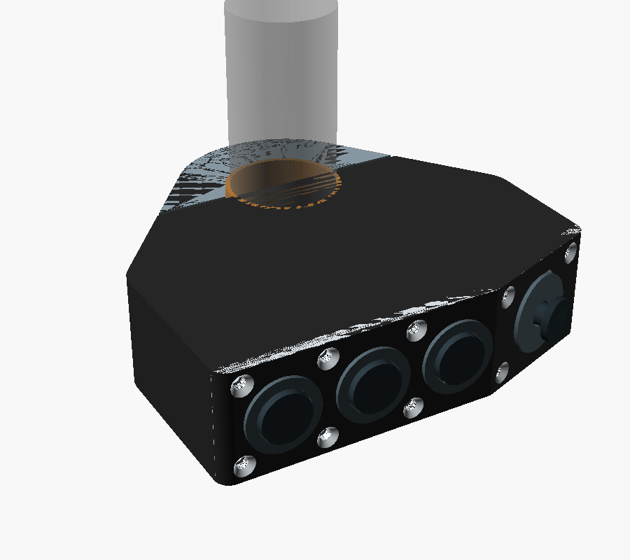
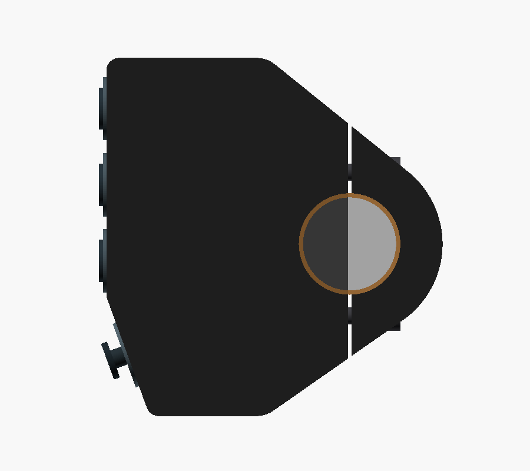
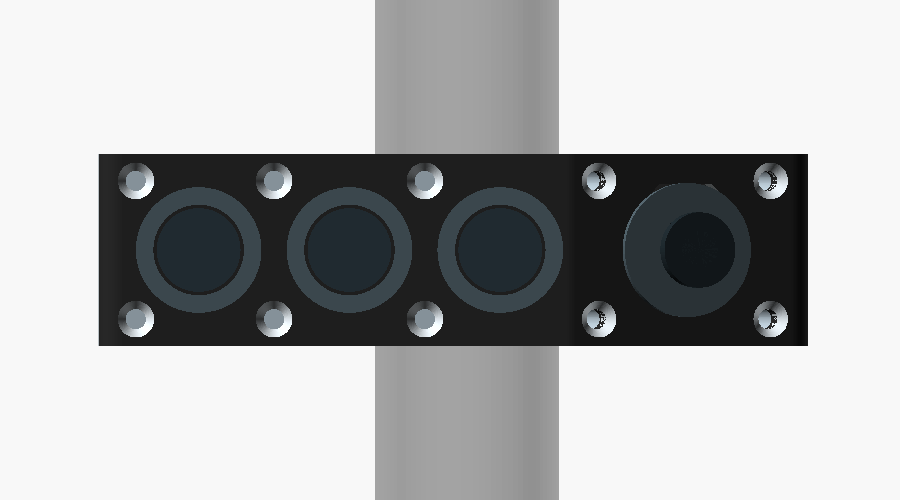
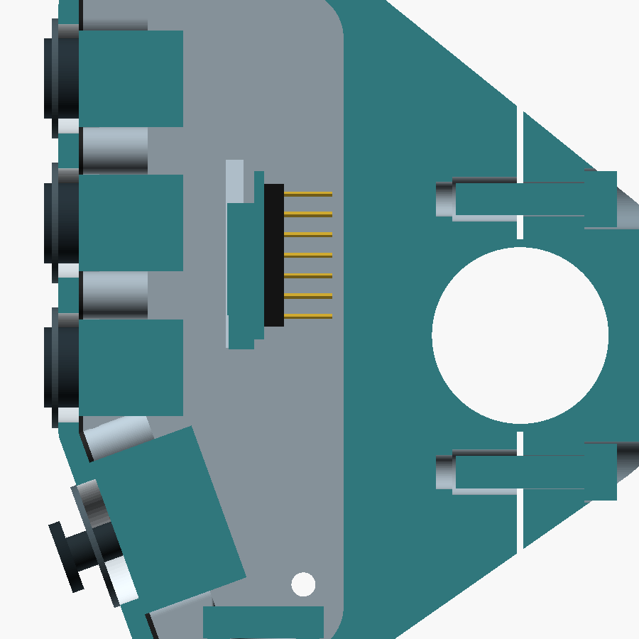
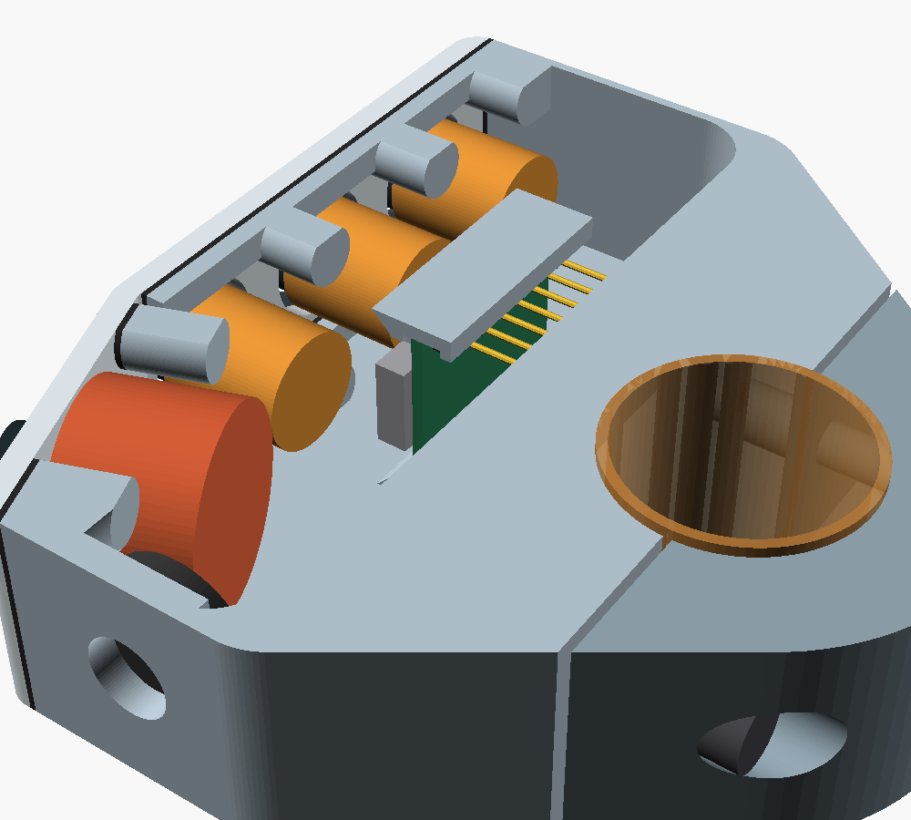
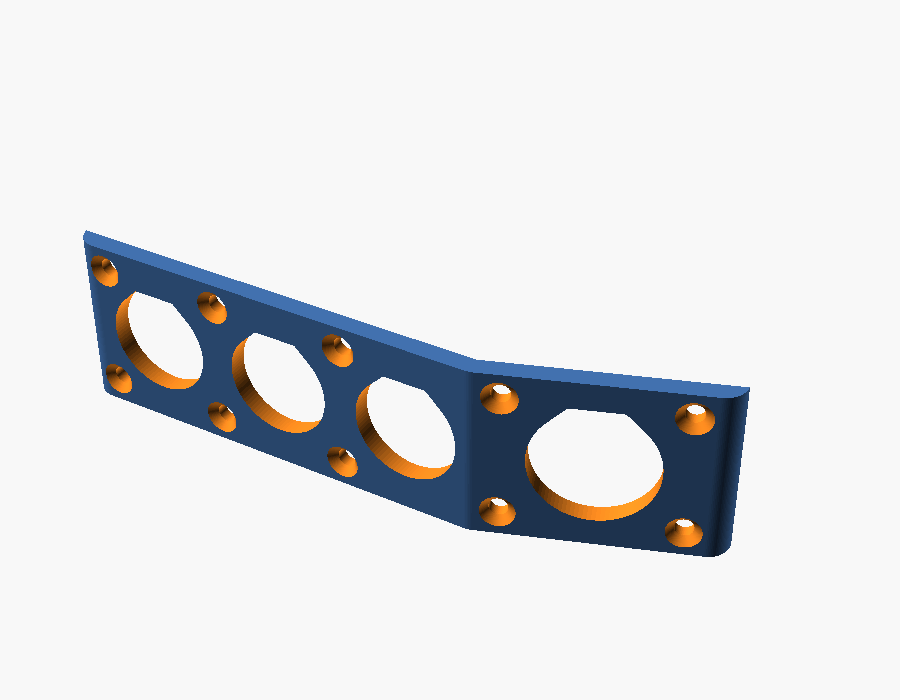
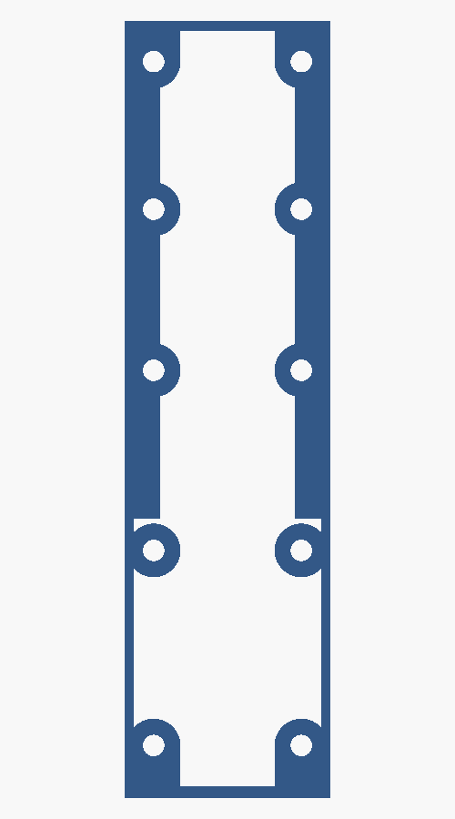

# Complete Mechanical CAD — V0.20 Folded Front and Sealing

V0.20 folds the control face between button C and the joystick and adds the first sealing measures. The upper facet carries the three buttons and stays where it was. The lower facet carries the joystick and turns 20° toward the bar, so the lower end of the pod sits 10.3 mm closer to the bar. This clears the thumb's path to the turn-signal switch, which the straight V0.19 face obstructed.

All printed housing parts are still slices of one outer silhouette: the convex hull of the pod outline and the Ø44 mm clamp circle, extruded 23 mm along the bar. Offsets of the folded front cut the cover and gasket from it; the diametral clamp split cuts the cap. Supplier and purchase unknowns remain open and are listed at the end; they are marked `MEASURE` in the CAD.

**Current parametric concept:** [complete-remote-v0.20.scad](../mechanical/cad/complete-remote-v0.20.scad)

All images are direct OpenSCAD renders of the V0.20 file.

## Changes from V0.19

- **Folded front.** The fold line is 12.5 mm below the bar axis, between button C and the joystick. The lower facet is 30 mm long and turns 20° toward the bar (`fold_angle`). The joystick sits 14.5 mm below the fold, 5 mm behind the upper facet, and points slightly down and toward the rider. The distance from button C to the joystick, measured over the surface, is 23 mm (18 mm in V0.19). Closer to the fold, the joystick body would hit button C's body.
- **Why 20° and not 30°.** At 30° the lower end sits 16 mm closer to the bar, but the end wall becomes too short for the gland lock nut beside the corner screw bosses. The gland then had to go to the top end wall, or the pod had to grow 7 mm. At 20° the gland fits at the bottom, and the pod is only 0.5 mm longer than the 30° version. The 30° values are noted next to `fold_angle` in the CAD.
- **Pod length.** The buttons move 3 mm up (Y = 32, 14, −4 mm) to make room for the fold, and the pod grows 3 mm at the top. The pod now spans Y = −40.7 to 44 mm (84.7 mm, was 82 mm). The axis-to-button-C distance is 57.5 mm perpendicular to the bar, unchanged.
- **Cover gasket.** A gasket sits between the cover and the housing. It is 0.6 mm when compressed: printed 0.8 mm thick in a soft TPU, or cut from 0.8–1 mm silicone or EPDM sheet using the flat model as a template. The housing land is the 1 mm wall plus a 3 mm lip inside both axial walls along the upper facet, and a Ø6 mm pad around every screw. The lower facet has only the 1 mm walls, because the joystick body fills the width there.
- **Cover screws.** Ten M2 × 8 countersunk screws replace the four M2 × 6. They sit in pairs at five positions: three on the upper facet, one 3.5 mm below the fold, and one at the lower corners. The largest spacing along the perimeter is 21.8 mm, so the 2.5 mm cover does not lift between screws.
- **Cover printing.** The cover now prints on its axial face, because the fold would need support face down. The control cutouts are horizontal in that orientation and have a flat top at 45°, hidden under the bezels.
- **Cable gland.** The gland stays in the bottom end wall, moved to X = −32 mm so its lock nut clears the corner screw bosses and the rear wall. `cable_at_bottom = false` moves it to the top end wall.
- **Vent.** A Ø3 mm hole in the Z = 0 axial wall at the low end takes an adhesive ePTFE vent label inside. The vent lets the sealed box breathe without letting water in.
- **XIAO raised 5 mm.** Y = 10 mm, so a USB-C plug clears the lower screw bosses when the cover is off.

## Interior space check

The OpenSCAD console reports these values; the boolean checks below were run on the rendered meshes.

| Check | Result |
|---|---|
| Control bodies vs housing, cover, gasket | No overlap |
| Joystick body vs button C body | Clear by more than 0.5 mm |
| Joystick body moved 0.5 mm along or across its facet | Still clear; the closest features are the screw bosses next to it (0.5–0.7 mm) |
| Joystick body clearance along the bar | 0.45 mm per side |
| XIAO envelope vs housing | No overlap in place, and none along a 22 mm slide-in path |
| XIAO vs controls | No overlap |
| Wiring space between button rear ends and XIAO component side | 5.5 mm |
| XIAO pin tips to cavity rear wall | 1.4 mm |
| USB-C plug (12 × 6.5 × 25 mm overmold) with the cover off | Clear of the housing and the gland nut |
| Gland lock nut (Ø15 × 4 mm envelope) | Clear of housing, controls, XIAO |
| Vent label area | Clear of housing features, joystick, XIAO |
| Cover screws vs controls and XIAO; countersinks vs bezels | No overlap |
| Wall around the M2 and M4 insert holes | At least 0.8 mm and 1.2 mm |
| Cover vs housing; gasket vs cover and housing; cap vs housing | Contact only, no overlap |
| Bar and liner (Ø24 mm) leaving the body toward the cap side | Clear |
| Each printed part | One closed solid |

The tightest points are still the joystick width (0.45 mm per side), the 1.4 mm behind the XIAO pins, and the joystick's 0.5–0.7 mm to the screw bosses next to it. All depend on parts that still have to be measured.

## Sealing

V0.20 aims for rain and spray resistance, not an IP rating. It has not been tested.

1. **Controls.** Use switches and a joystick rated for front-panel sealing (IP67 or better), with their panel gasket. This has not been verified for the APEM IS and Ruffy MHS order codes; check the datasheets before buying. If the controls are not sealed, the other measures do not help.
2. **Cover joint.** The gasket and ten screws described above. The 1 mm land on the lower facet and the end walls is the weak point.
3. **Cable.** An IP68 M8 gland matched to the cable diameter. Seal the outer thread with neutral-cure silicone.
4. **Vent.** An adhesive ePTFE vent label over the Ø3 mm hole, inside. Without it, temperature cycles pump humid air into a sealed box, and the water condenses inside. Mount the unit so the vent faces down or sideways, not into spray.
5. **Electronics.** Coat the XIAO and all solder joints with conformal coating (acrylic or silicone). Keep it off the USB-C socket, the switch contacts, and the vent membrane.
6. **Printed walls.** A 1 mm wall is only two perimeters with a 0.4 mm nozzle, and FDM layers can leak. Print PETG hot and slow for good layer bonding, or seal the outside with a thin coat of epoxy or lacquer.

## Printing

| Part | Mode | Orientation | Material (suggested) |
|---|---|---|---|
| Housing | `print_housing` | Upper facet on the bed | PETG or ASA |
| Clamp cap | `print_cap` | Axial face on the bed | PETG or ASA |
| Control cover | `print_cover` | Axial face on the bed | PETG or ASA |
| Gasket | `print_gasket` | Flat, 0.8 mm | Soft TPU (85A or softer), or cut from silicone/EPDM sheet |
| Liners ×2 | `liner_main`, `liner_cap` | Axial face on the bed | TPU 95A |

No part needs supports. On the housing, the walls are vertical, the lower facet is an open edge in the air, the lower screw bosses lean 20°, and the cavity's rear wall bridges 21 mm. The XIAO rails have 45° chamfers. The housing stands on its thin front rim and the cover on a 2.5 mm edge, so use a brim on both. Use 100% infill or at least four perimeters around the M4 insert holes. TPU 95A is probably too hard to seal at 0.2 mm compression; prefer a softer TPU or a cut sheet gasket.

## Assembly

1. Press the two M4 inserts into the housing split face and the ten M2 inserts into the cover bosses with a soldering iron.
2. Mount the three buttons and the joystick in the cover.
3. Pass the power cable through the gland in the bottom end wall, and solder its wires to the XIAO 5V and GND pins. Solder the control wires to the XIAO pins. The USB-C plug cannot pass through an M8 gland.
4. Slide the XIAO into the rails along +Y until it stops. Secure its free end with a drop of hot glue or silicone. Apply conformal coating.
5. Stick the vent label inside over the vent hole.
6. Lay the gasket on the housing land, folded at the fold line, and fit the cover with ten M2 × 8 countersunk screws. Tighten evenly in a cross pattern.
7. Fit the liner halves, place the housing on the bar, fit the cap from behind, and tighten the two M4 × 16 bolts evenly.

To program over USB, remove the cover. The USB-C socket is on the component side at the lower end of the board and opens toward the bottom of the pod; a plug fits there with the cover off. Each opening disturbs the gasket, so BLE firmware updates remain a firmware requirement.

## Hardware

| Item | Qty |
|---|---:|
| M4 × 16 ISO 4762 socket-head screw | 2 |
| M4 heat-set insert, short (hole Ø5.6 × 8.1 mm in CAD) | 2 |
| M2 × 8 ISO 10642 countersunk screw | 10 |
| M2 heat-set insert, about 4 mm long (hole Ø3.2 × 6 mm in CAD) | 10 |
| M8 × 1.25 IP68 cable gland for 3–5 mm cable | 1 |
| Adhesive ePTFE vent label, about Ø10 mm, for a Ø3 mm hole | 1 |
| Conformal coating, neutral-cure silicone | small amounts |

## NAVCOMM reference

The [NAVCOMM product page](https://hesaparts.com/product/navcomm/) is the project's stated reference. Its [official user manual](https://hesaparts.com/wp-content/uploads/2025/02/EN/NAVCOMM%20USER%20MANUAL.pdf) specifies a 22 mm handlebar, at least 23 mm of space between the grip and the motorcycle's switchgear, rotation of the unit to suit the rider's reach, and fixing with two M4 screws and a flange. The control arrangement is one function button, two function/zoom buttons, and a lower four-way joystick.

V0.8 follows those functional and packaging cues while keeping original geometry. The CAD uses 23 mm as the target width along the bar, matching the manual's minimum installation gap; the manual does not publish the NAVCOMM's own overall width. Two parallel M4 bolts on either side of the bar close the rear clamp cap; ten M2 screws hold the control cover. The side panel keeps button presses perpendicular to the bar and can rotate around the bar before tightening.

## Sourced dimensions and design targets

| Feature | CAD value | Basis |
|---|---:|---|
| XIAO nRF52840 board outline | 21 × 17.8 mm | Seeed Studio published dimensions |
| APEM IS button panel opening | Ø13.6 mm | APEM IS series drawing |
| APEM reduced bezel option | 15 mm | APEM IS series options; confirm exact ordered variant |
| MHS joystick thread / panel | M16 × 1 / 2–3 mm | Ruffy Controls MHS datasheet |
| MHS nominal panel opening | Ø15.80 mm | Ruffy drawing callout Ø0.622 in; full profile needs confirmation |
| Handlebar | Ø22 mm nominal | Project target; measure the actual straight section |
| Integrated clamp | Ø44 mm outer diameter, Ø24 mm bore | Diametral split into two 180-degree halves with a 0.8 mm clamping gap |
| Clamp radial section | 10 mm | Derived from Ø44 mm outer diameter and Ø24 mm bore; not strength-validated |
| Pod-to-clamp shoulders | Tangent lines from the 7 mm rear pod corners to the Ø44 mm ring | Convex hull of pod outline and clamp circle, following the marked silhouette |
| Pod front corners | 3 mm radius | Leaves a flat cover face for the M2 screws |
| Folded front | Upper facet normal to the pod axis; lower facet turned 20° toward the bar, fold 12.5 mm below the bar axis | Clears the thumb's path to the turn-signal switch; the angle is a parameter |
| Pod cavity corners | 2 mm front, 6 mm rear | 1 mm inset from the outer corners |
| Clamp liner | 1 mm radial TPU liner gives Ø22 mm nominal inner diameter | Parametric target; tune to measured bar and print process |
| Enclosure envelope | 79.5 × 84.7 mm in the plane of the clamp; 23 mm along the bar | Informed by the manual's 23 mm installation clearance; verify on the bike |
| Button direction | Button axes perpendicular to the handlebar axis | Layout requirement |
| Case wall / cover | 1.0 / 2.5 mm | Wall limited by the 20.1 mm joystick candidate; cover within both switch panel ranges |
| Control layout | Buttons at Y = 32, 14, −4 mm (18 mm pitch) on the upper facet; joystick 14.5 mm below the fold on the lower facet, 23 mm from button C measured over the surface | Layout target; confirm glove access and supplier bezel sizes |
| Clamp fasteners | Two parallel M4 × 16 ISO 4762 bolts at ±17 mm from the bar axis; Ø7.6 mm counterbores 8 mm from the split face; Ø5.6 × 8.1 mm insert holes | 7.6 mm grip, 7.6 mm engagement, 2.85 mm wall to bore; confirm against the bought bolts and inserts |
| Cover fasteners | Ten M2 × 8 ISO 10642 countersunk screws; Ø3.2 × 6 mm insert holes in Ø6 mm bosses | Spaced 16.5–21.8 mm along the perimeter to compress the gasket; confirm against the bought inserts |
| Cover gasket | 0.6 mm compressed (0.8 mm printed or cut) on the housing land | Land is 1 mm on the walls, 4 mm along the upper facet, Ø6 mm around each screw |
| Joystick body envelope | Ø20.1 mm MHS candidate | Supplier drawing target; 0.45 mm per side inside the 21 mm cavity |
| Cable entry | Ø8.2 mm hole in a 3 mm area of the bottom end wall | Seat for an M8 gland; verify after selecting the gland and cable |
| Vent | Ø3 mm hole in the axial wall at the low end, Ø10 mm flat area inside | For an adhesive ePTFE vent; verify against the chosen vent |
| USB cable jacket | 3–5 mm range candidate | Hummel M8 gland example; measure actual cable |
| XIAO PCB / header spacer / pins | 1.2 / 2.5 / 6 mm | Allowances for the pre-soldered version; measure the bought board |

Seeed lists the XIAO board at 21 × 17.8 mm and provides a [2D DXF drawing](https://wiki.seeedstudio.com/XIAO_BLE/). The purchased variant has pre-soldered headers; V0.20 keeps the board parallel to the control cover, behind the control bodies, with the header pins pointing away from the controls. The 2.5 mm spacer and 6 mm pin length are allowances, not supplier dimensions. The [Kiwi listing](https://www.kiwi-electronics.com/en/seeed-studio-xiao-nrf52840-pre-soldered-20402) confirms the headers are pre-soldered. Check the actual header, USB-C, antenna, and component clearances against the printed cavity before finalizing it.

The Ruffy [MHS datasheet](https://www.farnell.com/datasheets/4534112.pdf) specifies an M16 × 1 body, panel thickness 2–3 mm, and a nominal Ø0.622 in mounting callout. The drawing also contains a 0.291 in profile dimension and two rounded corners; V0.5 still models the nominal circle only. Its Ø20.1 mm body envelope nearly fills the axial cavity needed for the 23 mm package. Confirm the real joystick and print tolerance; this candidate may need replacement with a narrower part to preserve the compact width and a robust housing wall.

APEM's [IS series page](https://www.apem.com/panel-switches/pushbutton-switches/is) gives the Ø13.6 mm panel cutout, 13 mm behind-panel depth, 1.5–4 mm panel range, and 15 mm reduced-bezel option. Order-code availability and the reduced-bezel variant's exact drawing must be confirmed before selecting the production switch.

## Open unknowns before printing

These are the only items that block a confident first print. Each is a parameter in the CAD.

- **Switches and joystick:** exact order codes, sealing rating, nut sizes behind the panel, terminal length, and wire exit. If the joystick body is narrower than 20.1 mm behind the panel, it can sit closer to the fold and to button C. If a joystick nut behind the panel is wider than about 20 mm, it does not fit the 21 mm cavity.
- **XIAO:** PCB thickness, header spacer height, pin length, and component height. Adjust `xiao_pcb`, `xiao_header_plastic`, `xiao_pin_length`, and `xiao_component_h`; the render stops if the pins reach the rear wall.
- **Inserts:** hole diameters and depths for the actual M4 and M2 inserts.
- **Handlebar and liner:** measured bar diameter, and the 0.8 mm clamping gap tuned to the printed TPU liner.
- **Cable gland:** thread, lock-nut size (Ø15 × 4 mm assumed), and cable diameter.
- **Vent:** label diameter and required hole size.
- **Gasket:** material, and whether 0.2 mm of compression seals on a 1 mm land.
- **Fold angle:** 20° is chosen to clear the turn-signal switch while keeping the gland at the bottom, but it has not been checked on the bike.

Not addressed by this concept: IP rating, impact, vibration, and fatigue strength. These need physical testing.

## Earlier versions

V0.1–V0.19 remain available for comparison. V0.19 has a straight control face that gets in the way of the turn-signal switch, and no gasket. V0.18 is installable, but its cover does not match the housing and it has no cover, board, or gland mounting. V0.17 should not be printed: its 250-degree body cannot pass the handlebar. V0.13–V0.16 are superseded attempts at the shoulder silhouette and should not be printed. V0.13 left gaps at the shoulders. V0.14 dropped most of the pod through an incorrectly closed polygon. In V0.15 and V0.16 the same polygon traced the clamp arc as an inner boundary, so the fixed 250-degree ring was missing and only the removable cap surrounded the bar.
