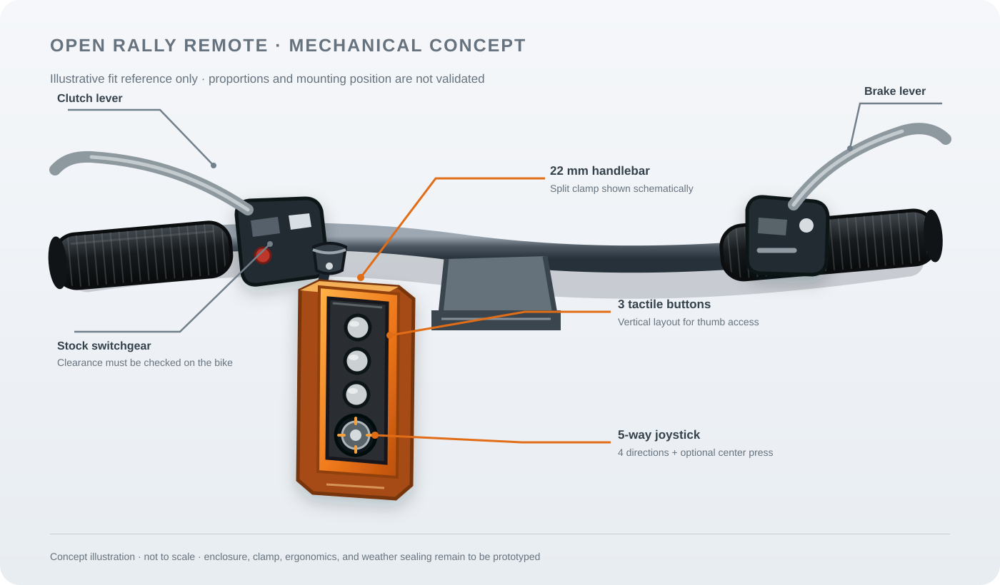
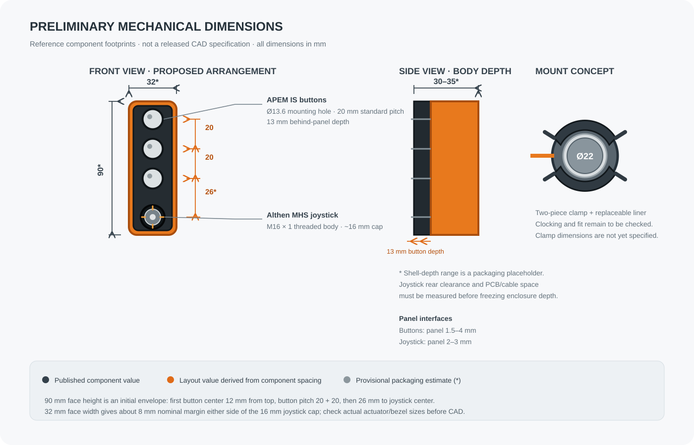

# Mechanical Concept — First Handlebar Prototype

**Status:** early concept for discussion and fit checks. No enclosure, mount, sealing method, or joystick has been validated on a motorcycle.

## Design intent

The remote should fit a 22 mm handlebar, occupy as little space as practical, and be buildable as a one-off with common tools and a 3D printer. Its three buttons and joystick should be operable with riding gloves. Rain, dust, and vibration resistance matter, but an IP rating must not be claimed until the assembled unit has been tested.

The reference arrangement is three buttons with a five-way joystick below them. The joystick has up, down, left, right, and optional center press. The lower-cost centerless version should remain possible if a suitable joystick variant is found.

This image is a layout reference, not a dimensioned CAD drawing. It shows one possible placement and should be checked against the builder's actual bar, levers, switchgear, guards, and riding position.

## Preliminary dimensional layout

The following envelope is a first packaging estimate, not a final part specification:

| Feature | Preliminary value | Basis / status |
|---|---:|---|
| Handlebar clamp interface | Ø22 mm nominal | Project target. Measure the actual bar at the selected location; many bars taper near the controls. |
| Pod face | 32 mm wide × 90 mm high | Layout estimate. The joystick cap is about 16 mm across; the button spacing and edge margins determine the height. Validate with actual parts and glove tests. |
| Pod depth | 30–35 mm placeholder | Not yet calculated. Confirm joystick rear clearance, PCB, connector, cable bend, gland, walls, and gasket before CAD. |
| Button mounting holes | Ø13.6 mm | APEM IS series standard bezel drawing; the bushing is Ø12 mm. |
| Button row pitch | 20 mm center-to-center | APEM IS standard matrix mounting. Three centers span 40 mm. |
| Button rear clearance | 13 mm | APEM IS published behind-panel depth. Panel thickness: 1.5–4 mm. |
| Joystick mounting | M16 × 1 thread; panel 2–3 mm | Althen MHS series. The datasheet drawing shows an approximately 16 mm actuator cap. Verify the exact cutout and rear geometry from the ordered variant's drawing before CAD. |
| Button-to-joystick center spacing | 26 mm | Proposed layout value, leaving roughly 11 mm between a 13.6 mm button opening and a 16 mm joystick cap. Confirm actual bezel and cap boundaries. |

The 90 mm face height places the first button center 12 mm from the top edge, uses two 20 mm button pitches, then 26 mm from the lowest button center to the joystick center. With a nominal 16 mm joystick cap this leaves about 4 mm below the cap and about 5 mm between the top button edge and the enclosure edge. The 32 mm face width allows about 8 mm on either side of a nominal 16 mm joystick cap. These are layout dimensions, not comfortable-glove clearances proven by testing.

The button reference is the [APEM IS sealed momentary pushbutton series](https://www.apem.com/panel-switches/pushbutton-switches/is); its datasheet provides the 13 mm rear depth, Ø13.6 mm cutout, 20 mm standard pitch, IP67 front-panel sealing, and 1 million mechanical cycles. The joystick reference is the [Althen MHS datasheet](https://www.althensensors.com/uploads/products/datasheets/MHS-Series-compact-5-way-switching-joystick-en.pdf), which specifies an M16 × 1 threaded body, 2–3 mm panel, IP67 above-panel sealing, potted leads, and a five-way variant with a top switch.

## Concept A — compact vertical pod

Arrange Button A, B, and C in a vertical column, with the joystick at the bottom. Point the control face generally toward the rider and slightly upward, while keeping it clear of the stock switchgear, brake/clutch lever travel, and hand movement. The exact angle and left/right mounting side must be adjustable during fit checks.

The enclosure can be a narrow two-piece pod with:

- A front control carrier that holds the buttons and joystick as replaceable parts.
- A rear electronics cavity sized around the PCB and cable bend radius, not around the temporary breadboard.
- A removable rear cover with a perimeter gasket and captive stainless fasteners.
- A USB power cable entering from the underside through a correctly sized cable gland, with internal strain relief and a drip loop.
- A handlebar clamp that can be clocked around the bar before tightening.

Keep the joystick and buttons as close together as glove use allows. Avoid adding a large flange or decorative bezel around each control. The outer envelope should be measured against the rider's bike before deciding dimensions.

## Joystick candidates

### Low-cost bench and shape prototype

The [Tecnoteca 5D Rocker module](https://www.tecnoteca.es/producto/modulo-joystick-5-direcciones/) is listed at 25 × 41 mm and has four direction contacts plus a center contact. It is an exposed PCB module, not a sealed handlebar part. Use it to check the five-way interaction and rough face layout, not as the final weatherproof control.

### Sealed discrete-switch candidate

The [Althen MHS series](https://www.althencontrols.com/industrial-joysticks-and-foot-pedals/industrial-joysticks/mini-joysticks/mhs-series-compact-5-way-switching-joystick/) is a panel-mounted, discrete-contact joystick family with an optional center pushbutton. Published data lists IP67 sealing above the panel, an M16 × 1 mounting thread, 13 g mass, and 3 million operating cycles. It appears electrically compatible with five GPIO inputs and a common ground. Price and exact configuration require a quote.

This part is a promising durability reference, not a selection: the 16 mm mounting body may dominate the pod width, and the full dimensions, lead exit, actuation feel with gloves, and price need checking. Consider center-button and centerless variants separately.

## Handlebar attachment concept

Start with a two-piece clamp around the nominal 22 mm bar, using a replaceable non-slip elastomer liner and two fasteners so the pod resists rotation. Keep the clamp separate from the electronics enclosure: this lets builders print or adapt the mount without redesigning the sealed control cavity. Allow clocking adjustment, and publish the clamp dimensions and model parametrically.

Check bar diameter at the intended location, nearby taper, cable routing, control clearance, and whether the mount can be installed without removing original controls. Do not assume every control area is a straight 22 mm section. Avoid sharp clamp edges and ensure the mount cannot interfere with steering, throttle return, brake, clutch, or hand guards.

## Prototype construction approach

For the first physical mock-up, print a non-sealed shell and clamp to test reach, sightline, glove operation, and interference. Use the real joystick module or a dimensionally accurate dummy. Keep the electronics as a removable insert or tray so the enclosure can be revised without disturbing the breadboard wiring.

For later iterations, evaluate PETG or ASA for printed structural parts and a replaceable TPU/EPDM gasket. Material choice alone does not make the assembly waterproof. Use a cable gland matched to the cable diameter, sealed control components, controlled screw compression, and a defined water test. A printed enclosure's layer lines, fastener bosses, cable entry, and button interfaces are likely leak paths.

## Measurements to collect before CAD is frozen

1. Available straight handlebar length and measured diameter at the intended clamp location.
2. Clearance to stock switchgear, levers, hand guards, tank, and full-lock steering movement.
3. Rider reach and control-face angle while seated and standing, with representative gloves.
4. Actual board, connector, cable-gland, and joystick dimensions, including wire bend radius.
5. Minimum spacing that still lets each control be identified by touch without accidental activation.
6. Joystick sample price, center-press option, mounting details, and tactile force.

## Open decisions

- Which side of the handlebar and which face orientation works best on the owner's motorcycle?
- Is the MHS-class panel joystick compact enough, or should the project develop a custom discrete-switch mechanism?
- Should the joystick's center switch be a separate optional part or integrated in the selected joystick?
- Which print process and gasket geometry are accessible to individual builders?
- What dimensions and installation checks should the parametric mount expose for different bikes?

## Next mechanical iteration

Make a simple adjustable dummy pod and clamp first. Test its envelope and controls on the actual motorcycle before detailing the sealed enclosure. Then publish the measured dimensions and a parametric CAD model with an initial bill of materials and assembly notes.
