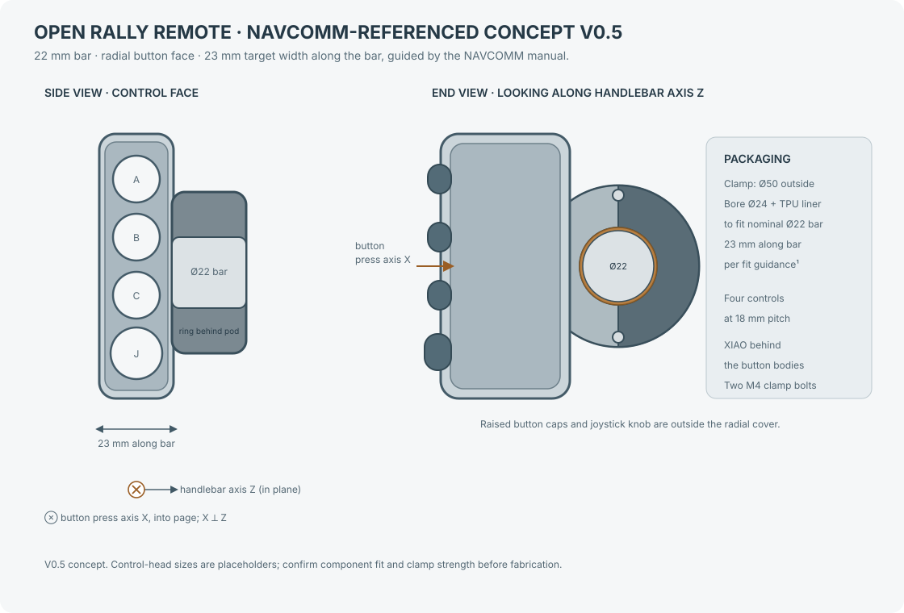

# Complete Mechanical CAD — V0.5 NAVCOMM-Referenced Concept

V0.5 corrects the control assembly: the radial cover openings go all the way through, and the button caps and joystick knob sit outside the enclosure and connect through the panel to their switch-body envelopes inside. It keeps the NAVCOMM-referenced layout: a compact pod around a 22 mm handlebar, three buttons in a row, and the joystick at the bottom. The button press axes are perpendicular to the bar. The body can be rotated around the bar to set the control angle, and a removable opposite clamp half is tightened with two M4 fasteners. The XIAO sits behind the controls.

**Current parametric concept:** [complete-remote-v0.5.scad](../mechanical/cad/complete-remote-v0.5.scad)

The OpenSCAD file builds the integrated main body, opposite clamp cap, perforated radial cover, exposed control heads, split liner, and internal component envelopes. Set `show_internals = false` to hide the switch-body and XIAO envelopes; the exterior control heads remain visible. Set `part_to_render` to `"housing"`, `"clamp_cap"`, `"cover"`, `"liner_main"`, or `"liner_cap"` to export a part. The SVG is a dimensioned concept view; the editable geometry is the SCAD file. Button heads and joystick knob are visual placeholders until exact supplier parts are selected and measured.

## NAVCOMM reference

The [NAVCOMM product page](https://hesaparts.com/product/navcomm/) is the project's stated reference. Its [official user manual](https://hesaparts.com/wp-content/uploads/2025/02/EN/NAVCOMM%20USER%20MANUAL.pdf) specifies a 22 mm handlebar, at least 23 mm of space between the grip and the motorcycle's switchgear, rotation of the unit to suit the rider's reach, and fixing with two M4 screws and a flange. The control arrangement is one function button, two function/zoom buttons, and a lower four-way joystick.

V0.4 follows those functional and packaging cues while keeping original geometry. The CAD uses 23 mm as the target width along the bar, matching the manual's minimum installation gap; the manual does not publish the NAVCOMM's own overall width. The manual's M4 screws fasten the reference unit to its flange, while this concept's two M4 through-bolts close the split clamp. The side panel keeps button presses perpendicular to the bar and can rotate around the bar before tightening.

## Assembly parts represented

1. **Integrated main body:** a C-shaped main clamp half joined directly to the control pod. Its annular wall is the rear structural housing around the bar.
2. **Removable clamp cap:** the opposite half ring closes the clamp and is secured by two transverse M4 through-bolts with locknuts in this initial concept. Verify bolt length, wrench access, and lug strength in a printed prototype.
3. **Radial control face:** A/B/C and joystick openings are on the pod's side face. Their actuation axes are perpendicular to the handlebar axis.
4. **Electronics pod:** the XIAO is turned 90 degrees behind the control bodies inside the pod; a preliminary cable entry is included at the lower end.
5. **Replaceable liner:** two semicircular TPU pieces fit between the Ø24 mm clamp bore and nominal Ø22 mm handlebar.

## Sourced dimensions and design targets

| Feature | CAD value | Basis |
|---|---:|---|
| XIAO nRF52840 board outline | 21 × 17.8 mm | Seeed Studio published dimensions |
| APEM IS button panel opening | Ø13.6 mm | APEM IS series drawing |
| APEM reduced bezel option | 15 mm | APEM IS series options; confirm exact ordered variant |
| MHS joystick thread / panel | M16 × 1 / 2–3 mm | Ruffy Controls MHS datasheet |
| MHS nominal panel opening | Ø15.80 mm | Ruffy drawing callout Ø0.622 in; full profile needs confirmation |
| Handlebar | Ø22 mm nominal | Project target; measure the actual straight section |
| Integrated clamp | Ø50 mm outer diameter, Ø24 mm bore | Parametric packaging target; currently a two-part split ring |
| Clamp liner | 1 mm radial TPU liner gives Ø22 mm nominal inner diameter | Parametric target; tune to measured bar and print process |
| Enclosure envelope | About 80 × 82 mm around the control face; 23 mm along the bar | Current concept target informed by the manual's 23 mm installation clearance; verify on the bike |
| Button direction | Button axes perpendicular to the handlebar axis | Layout requirement; reflected in V0.3 coordinate system |
| Case wall / cover | 1.0 / 2.5 mm | Compact prototype target; assess wall strength and print process |
| Control pitch | 18 mm, four controls | Layout target; confirm glove access and supplier bezel sizes |
| Clamp fasteners | Two transverse M4 through-bolts | Initial target; choose length, washers, and locknuts after prototype fit |
| Joystick body envelope | Ø20.1 mm MHS candidate | Supplier drawing target; leaves only 0.9 mm total axial clearance inside the 21 mm cavity before tolerances |
| Cable entry | Ø8.2 mm preliminary pass-through; gland seat not modeled yet | Initial layout only; verify after selecting the gland and cable |
| USB cable jacket | 3–5 mm range candidate | Hummel M8 gland example; measure actual cable |
| XIAO header projection | 6 mm | Packaging allowance for the pre-soldered version; measure the bought board |

Seeed lists the XIAO board at 21 × 17.8 mm and provides a [2D DXF drawing](https://wiki.seeedstudio.com/XIAO_BLE/). The purchased variant has pre-soldered headers; V0.4 places the board parallel to the radial control cover, behind the button bodies. The 6 mm header projection is an allowance, not a supplier dimension. The [Kiwi listing](https://www.kiwi-electronics.com/en/seeed-studio-xiao-nrf52840-pre-soldered-20402) confirms the headers are pre-soldered. Check the actual header, USB-C, antenna, and component clearances against the printed cavity before finalizing it.

The Ruffy [MHS datasheet](https://www.farnell.com/datasheets/4534112.pdf) specifies an M16 × 1 body, panel thickness 2–3 mm, and a nominal Ø0.622 in mounting callout. The drawing also contains a 0.291 in profile dimension and two rounded corners; V0.5 still models the nominal circle only. Its Ø20.1 mm body envelope nearly fills the axial cavity needed for the 23 mm package. Confirm the real joystick and print tolerance; this candidate may need replacement with a narrower part to preserve the compact width and a robust housing wall.

APEM's [IS series page](https://www.apem.com/panel-switches/pushbutton-switches/is) gives the Ø13.6 mm panel cutout, 13 mm behind-panel depth, 1.5–4 mm panel range, and 15 mm reduced-bezel option. Order-code availability and the reduced-bezel variant's exact drawing must be confirmed before selecting the production switch.

## Power cable and service access

The model includes a preliminary Ø8.2 mm cable entry through the lower end wall of the pod. It does not yet model a selected gland, its nut/seat, strain relief, or the complete wire route. One candidate is [Hummel's M8 × 1.25 gland](https://www.hummel.com/en/product-finder-cable-gland/products/metal-cable-glands/hsk-mini/1106080055-wadi-a-fpm-m8x1-25/), listed for 3–5 mm cable; select and measure the actual cable and gland before adding their mounting features to the CAD.

The cover and clamp have preliminary screw-clearance holes, but the mating bosses, nut traps/inserts, sealing features, and fastener lengths are not yet designed. The XIAO USB-C connector is inside the enclosure in this arrangement; the CAD does not yet define a sealed external programming port. Phone-based BLE firmware updates remain a firmware requirement.

## What is still required before fabrication

- Confirm button and joystick exact order codes and use the full supplier drawings or measured samples to model their bodies, nuts, terminals, leads, and complete panel cutouts.
- Measure the purchased XIAO including header projection, USB-C connector, component heights, and antenna keepout; verify the rotated board fit, pod cavity, and cable route against the actual board.
- Measure the bike's straight 22 mm handlebar section. Verify the liner, clamp installation direction, steering clearance, and control interference on the motorcycle.
- Print and load-test the split-ring body, cap, bolt lugs, and liner. This CAD expresses the integrated architecture but does not establish fatigue or impact strength without physical testing.
- Choose the actual cable gland, cover seal, clamp bolts/nuts or inserts, and service fasteners; add their seats and access to the CAD.
- Check printed-part tolerances, wall strength, fastener pull-out, glove reach, water ingress, vibration, and impact on physical prototypes. This concept does not establish an IP rating.

This is a **full-form CAD concept**, not yet a manufacturing release. Dimensions marked as sourced come from the linked supplier references; the enclosure, cable, clamp, control-head, and fastener dimensions are initial design targets for measurement and prototype revision. V0.1–V0.4 remain available as earlier layouts for comparison.
