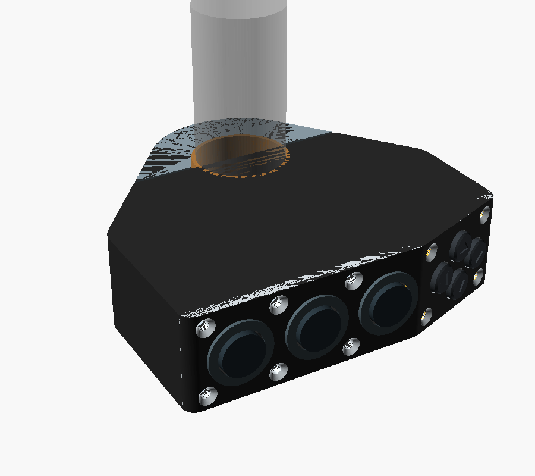
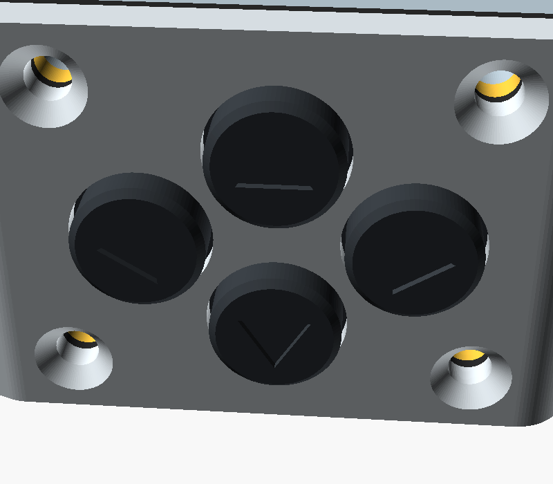
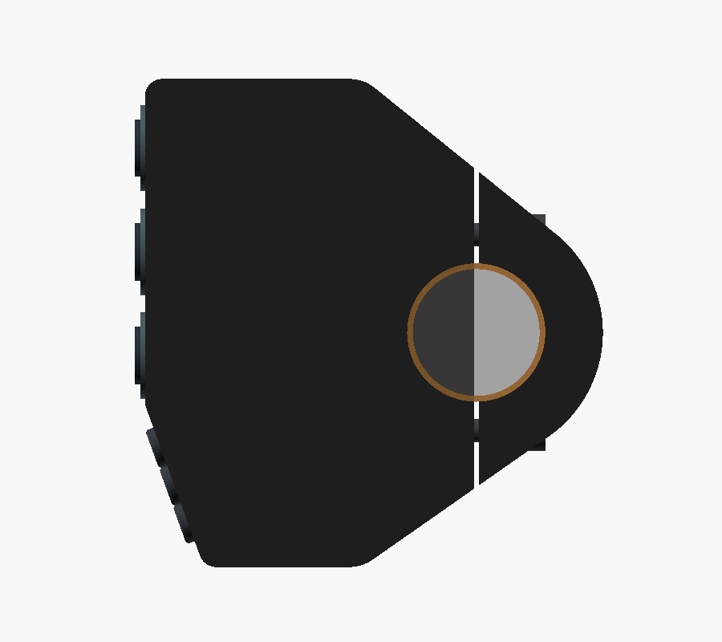
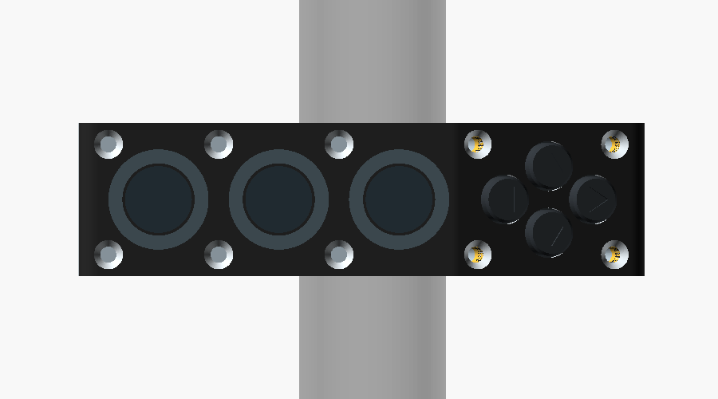
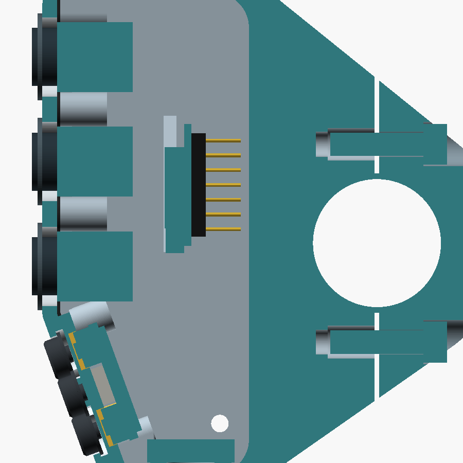
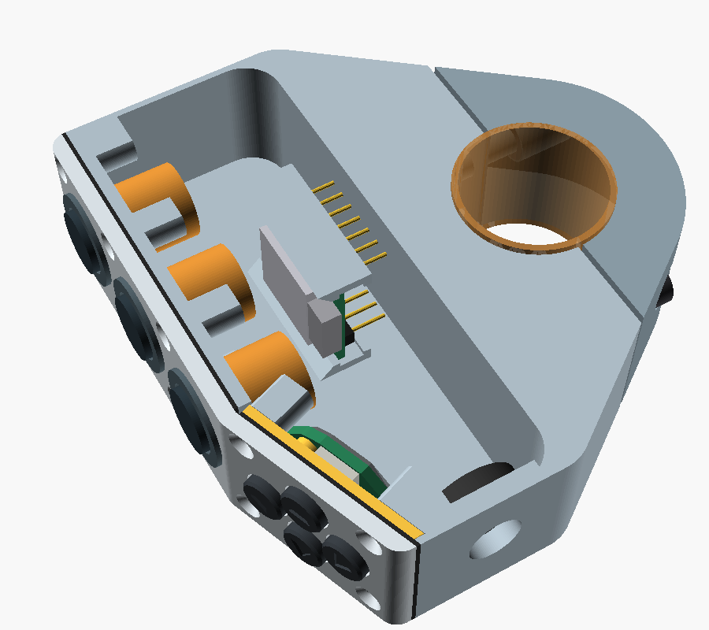
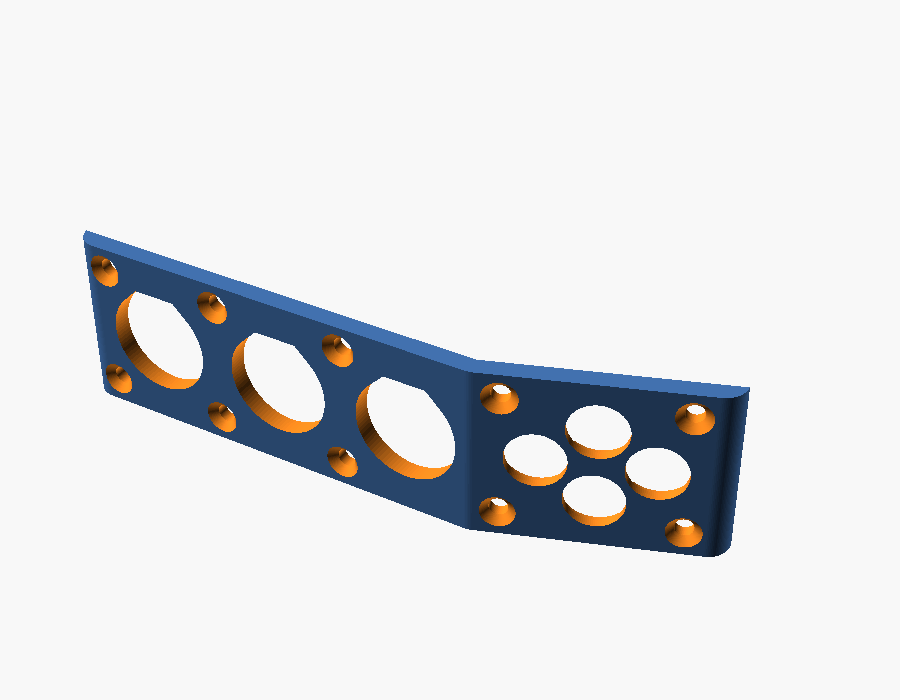
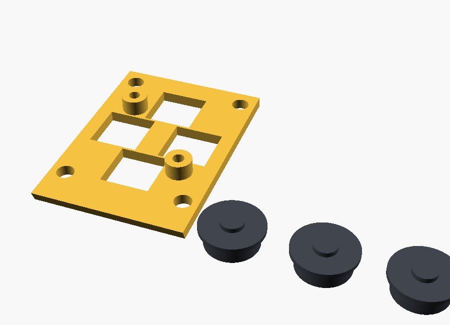

# Complete Mechanical CAD — V0.21 Direction Pad

V0.21 replaces the panel joystick on the lower facet with a direction pad: four round keys in a diamond, each over its own sealed tact switch on a small PCB. There is no centre key. The upper facet with buttons A, B and C, the 20° fold, the clamp and the rest of the housing are unchanged from V0.20.

The pad uses parts that cost a few euros instead of the Ruffy MHS joystick, which was listed at about £149 for one unit. It is also 6.6 mm shallower. The layout follows the arrow keys of the [Remotek One](https://www.remotek.no/product-page/remote1): separate round keys with arrows, so the rider reads them as four buttons rather than a joystick.

All printed housing parts are still slices of one outer silhouette: the convex hull of the pod outline and the Ø44 mm clamp circle, extruded 23 mm along the bar. Offsets of the folded front cut the cover and gasket from it; the diametral clamp split cuts the cap. Supplier and purchase unknowns remain open and are listed at the end; they are marked `MEASURE` in the CAD.

**Current parametric concept:** [complete-remote-v0.21.scad](../mechanical/cad/complete-remote-v0.21.scad)

All images are direct OpenSCAD renders of the V0.21 file.

## Changes from V0.20

- **Direction pad.** Four C&K KSC2 sealed SMT tact switches (6.2 × 6.2 × 3.5 mm, IP67) on a small PCB replace the MHS joystick. They are in a diamond around the pad centre, 14.75 mm below the fold:
  - The up and down keys are 7 mm above and below the centre along the facet. Up is toward button C.
  - The two side keys are 5 mm either side of the centre along the bar.
  - The joystick's centre press is dropped. Firmware inputs D3–D6 stay the direction inputs; D7 stays unused, which is the no-centre variant already allowed in the firmware specification.
- **Keys.** The keys are printed and round, Ø7 mm, standing 1.5 mm proud of the cover, each with an engraved arrow pointing outward.
  - Each key runs in its own Ø7.5 mm window in the cover. A Ø8.3 mm flange in a pocket in the cover back retains it, and a Ø3 mm nub under the key presses the switch through the gasket sheet.
  - Every key moves straight on its own switch. There is no rocker, so press quality does not depend on a pivot gap.
  - The flange has 0.65 mm of free travel before it meets the sheet. That is more than the switch's maximum travel of 0.5 mm, so the flange cannot stop the press before the switch trips.
- **Why Ø7 and not Ø8 keys.** Three things set the key size: the 23 mm width, at least 2 mm of clamped sheet around every pocket, and the 30 mm lower facet. Ø8 keys would need the lower facet 2.6 mm longer.
- **Sheet gasket on the lower facet.** On the lower facet the gasket is no longer a 1 mm wall land but a full sheet.
  - Between the cover and a printed keypad plate, it seals the cover joint and is the membrane over the key windows at the same time.
  - The clamped sheet around the key pockets is 2.3 mm wide toward the fold and 2.05 mm toward the axial edges. Toward the lower end, the last pocket ends at 26.2 mm of the 30 mm facet.
  - The upper facet gasket is unchanged.
- **Keypad plate.** A 1.5 mm printed plate fills the lower-facet cavity behind the sheet.
  - The four lower cover screws pass through it, and their bosses now start behind it. The plate clamps the sheet with the same screws as the cover; no new fastener goes into the cover.
  - The switch bodies sit in its four square holes. The pad PCB screws to its two standoffs with two M2 thread-forming screws.
- **Lower cover screws.** The four lower-facet cover screws are now M2 × 10, because they also pass through the plate. They engage 5.4 mm into the inserts. The six upper-facet screws stay M2 × 8.
- **Depth.** The pad, PCB and solder space end 9.4 mm behind the outer face. The MHS joystick body reached 16 mm.

### V0.20 changes, still current

- **Folded front.** The fold line is 12.5 mm below the bar axis, between button C and the lower control. The lower facet is 30 mm long and turns 20° toward the bar (`fold_angle`), so its lower end sits 10.3 mm closer to the bar. This clears the thumb's path to the turn-signal switch, which the straight V0.19 face obstructed.
- **Why 20° and not 30°.** At 30° the lower end sits 16 mm closer to the bar, but the end wall becomes too short for the gland lock nut beside the corner screw bosses. The gland then had to go to the top end wall, or the pod had to grow 7 mm. The 30° values are noted next to `fold_angle` in the CAD.
- **Pod length.** Buttons at Y = 32, 14, −4 mm; the pod spans Y = −40.7 to 44 mm (84.7 mm). The axis-to-button-C distance is 57.5 mm perpendicular to the bar.
- **Cover gasket.** 0.6 mm when compressed: printed 0.8 mm thick in a soft TPU, or cut from 0.8–1 mm silicone or EPDM sheet using the flat model as a template. On the upper facet the housing land is the 1 mm wall plus a 3 mm lip inside both axial walls, and a Ø6 mm pad around every screw.
- **Cover screws.** Ten countersunk M2 screws in pairs at five positions: three on the upper facet, one 3.5 mm below the fold, and one at the lower corners. The largest spacing along the perimeter is 21.8 mm.
- **Cover printing.** The cover prints on its axial face, because the fold would need support face down.
- **Cable gland.** In the bottom end wall at X = −32 mm. `cable_at_bottom = false` moves it to the top end wall.
- **Vent.** A Ø3 mm hole in the Z = 0 axial wall at the low end takes an adhesive ePTFE vent label inside.
- **XIAO.** At Y = 10 mm, so a USB-C plug clears the lower screw bosses when the cover is off.

## Interior space check

The OpenSCAD console reports these values; the boolean checks below were run on the rendered meshes.

| Check | Result |
|---|---|
| Button bodies vs housing, cover, gasket | No overlap |
| Pad switches and PCB vs housing, cover, gasket, keys | No overlap |
| Pad switches and PCB vs keypad plate | Contact only (switches in the plate holes, PCB on the standoffs) |
| Keys vs cover | Contact only (flange against the pocket ceiling at rest) |
| Keys vs gasket | 0.05 mm clear at rest |
| Keys pressed 0.5 mm | Clear of the cover and the plate |
| Keypad plate vs housing, cover | No overlap; contact with the shortened bosses |
| Keypad plate and pad vs buttons, XIAO, XIAO slide-in path, USB-C plug, gland nut, vent | No overlap |
| Pad PCB vs lower screw bosses | Clear; the closest point is at the lower right standoff |
| Cover screws vs pad, keys, buttons, XIAO; countersinks vs key pockets | No overlap |
| XIAO envelope vs housing | No overlap in place, and none along a 22 mm slide-in path |
| Wiring space between button rear ends and XIAO component side | 5.5 mm |
| XIAO pin tips to cavity rear wall | 1.4 mm |
| USB-C plug (12 × 6.5 × 25 mm overmold) with the cover off | Clear of the housing and the gland nut |
| Gland lock nut (Ø15 × 4 mm envelope); vent label area | Contact only with the housing faces they sit on |
| Wall around the M2 insert holes | At least 0.8 mm |
| Cover vs housing; gasket vs cover and housing | Contact only, no overlap |
| Each printed part | One closed solid |

The tightest points are now:
- the 1.4 mm behind the XIAO pins;
- 0.35–0.55 mm between the PCB standoffs and the switch bodies (modelled at their 6.5 mm maximum);
- the stack that sets the key travel: switch height, sheet thickness, and the printed pocket and nub. Tune `key_nub_clear` after measuring the printed parts.

## Sealing

V0.21 aims for rain and spray resistance, not an IP rating. It has not been tested.

1. **Buttons.** Use buttons rated for front-panel sealing (IP67 or better), with their panel gasket. This has not been verified for the APEM IS order codes; check the datasheets before buying.
2. **Direction pad.** The KSC2 switches are IP67 on their own, but the key windows are open to the outside. The sheet gasket is the seal there: it must stay clamped all round each pocket. Water that gets past a key stays in the pocket between the cover and the sheet.
3. **Cover joint.** The gasket and ten screws. On the lower facet the sheet is clamped over the whole facet. The weak point is now the 1 mm land on the upper-facet end walls.
4. **Cable.** An IP68 M8 gland matched to the cable diameter. Seal the outer thread with neutral-cure silicone.
5. **Vent.** An adhesive ePTFE vent label over the Ø3 mm hole, inside. Without it, temperature cycles pump humid air into a sealed box, and the water condenses inside. Mount the unit so the vent faces down or sideways, not into spray.
6. **Electronics.** Coat the XIAO, the pad PCB and all solder joints with conformal coating (acrylic or silicone). Keep it off the USB-C socket, the switch actuators, and the vent membrane.
7. **Printed walls.** A 1 mm wall is only two perimeters with a 0.4 mm nozzle, and FDM layers can leak. Print PETG hot and slow for good layer bonding, or seal the outside with a thin coat of epoxy or lacquer.

## Printing

| Part | Mode | Orientation | Material (suggested) |
|---|---|---|---|
| Housing | `print_housing` | Upper facet on the bed | PETG or ASA |
| Clamp cap | `print_cap` | Axial face on the bed | PETG or ASA |
| Control cover | `print_cover` | Axial face on the bed | PETG or ASA |
| Keypad plate | `print_keypad_plate` | Sheet side on the bed | PETG |
| Keys ×4 | `print_keys` | Top face on the bed | PETG or ASA |
| Gasket | `print_gasket` | Flat, 0.8 mm | Soft TPU (85A or softer), or cut from silicone/EPDM sheet |
| Liners ×2 | `liner_main`, `liner_cap` | Axial face on the bed | TPU 95A |

No part needs supports.
- **Housing:** the walls are vertical, the lower facet is an open edge in the air, the lower screw bosses lean 20°, and the cavity's rear wall bridges 21 mm. The XIAO rails have 45° chamfers. It stands on its thin front rim, so use a brim.
- **Cover:** the key windows are Ø7.5 mm horizontal holes, small enough to bridge. The pockets behind them are teardrops. It stands on a 2.5 mm edge, so use a brim.
- **Keys:** the arrow is engraved in the first layers, and the flange overhangs the stem by 0.65 mm.
- **Inserts:** use 100% infill or at least four perimeters around the M4 insert holes.
- **Gasket:** TPU 95A is probably too hard to seal at 0.2 mm compression; prefer a softer TPU or a cut sheet gasket. The sheet must not have holes at the keys.

## Assembly

1. Press the two M4 inserts into the housing split face and the ten M2 inserts into the housing screw bosses with a soldering iron.
2. Mount the three buttons in the cover.
3. Solder the four KSC2 switches to the pad PCB. Screw the PCB onto the keypad plate standoffs with two M2 × 5 thread-forming screws; the switch bodies enter the plate's square holes.
4. Solder five wires from the pad PCB to the XIAO: one per direction to D3–D6, and one to GND. Solder the button wires as before.
5. Pass the power cable through the gland in the bottom end wall, and solder its wires to the XIAO 5V and GND pins. The USB-C plug cannot pass through an M8 gland.
6. Slide the XIAO into the rails along +Y until it stops. Secure its free end with a drop of hot glue or silicone. Apply conformal coating to both boards.
7. Stick the vent label inside over the vent hole.
8. Lay the cover face down. Drop the four keys into their windows from the inside, arrows outward. The up key is the one nearest the fold.
9. Lay the gasket on the cover, folded at the fold line. Place the keypad plate on the lower-facet sheet, sheet side down, with its screw holes over the cover's.
10. Lower the housing onto the stack; its walls locate the plate. Turn the assembly over and fit the six M2 × 8 screws on the upper facet and the four M2 × 10 screws on the lower facet. Tighten evenly in a cross pattern.
11. Fit the liner halves, place the housing on the bar, fit the cap from behind, and tighten the two M4 × 16 bolts evenly.

To program over USB, remove the cover. The USB-C socket is on the component side at the lower end of the board and opens toward the bottom of the pod; a plug fits there with the cover off. Each opening disturbs the gasket, so BLE firmware updates remain a firmware requirement.

## Hardware

| Item | Qty |
|---|---:|
| M4 × 16 ISO 4762 socket-head screw | 2 |
| M4 heat-set insert, short (hole Ø5.6 × 8.1 mm in CAD) | 2 |
| M2 × 8 ISO 10642 countersunk screw (upper facet) | 6 |
| M2 × 10 ISO 10642 countersunk screw (lower facet) | 4 |
| M2 heat-set insert, about 4 mm long (hole Ø3.2 × 6 mm in CAD) | 10 |
| C&K KSC2 sealed tact switch, 2 N, J-bend (for example KSC222JLFS) | 4 |
| Pad PCB, about 17 × 21 mm, 1.6 mm (not designed yet) | 1 |
| M2 × 5 thread-forming screw for plastics (pad PCB) | 2 |
| M8 × 1.25 IP68 cable gland for 3–5 mm cable | 1 |
| Adhesive ePTFE vent label, about Ø10 mm, for a Ø3 mm hole | 1 |
| Conformal coating, neutral-cure silicone | small amounts |

The KSC2 J-bend terminals sit under the switch body and are hard to solder with an iron. Use hot air or have the PCB assembled. The gull-wing version (`G`) is easier by hand. Its terminals stick out beyond the body; their overall length is not in the datasheet copy used here, so it has not been checked against the standoffs.

## NAVCOMM reference

The [NAVCOMM product page](https://hesaparts.com/product/navcomm/) is the project's stated reference. Its [official user manual](https://hesaparts.com/wp-content/uploads/2025/02/EN/NAVCOMM%20USER%20MANUAL.pdf) specifies a 22 mm handlebar, at least 23 mm of space between the grip and the motorcycle's switchgear, rotation of the unit to suit the rider's reach, and fixing with two M4 screws and a flange. The control arrangement is one function button, two function/zoom buttons, and a lower four-way joystick.

V0.8 follows those functional and packaging cues while keeping original geometry. The CAD uses 23 mm as the target width along the bar, matching the manual's minimum installation gap; the manual does not publish the NAVCOMM's own overall width. Two parallel M4 bolts on either side of the bar close the rear clamp cap; ten M2 screws hold the control cover. The side panel keeps button presses perpendicular to the bar and can rotate around the bar before tightening.

## Sourced dimensions and design targets

| Feature | CAD value | Basis |
|---|---:|---|
| XIAO nRF52840 board outline | 21 × 17.8 mm | Seeed Studio published dimensions |
| APEM IS button panel opening | Ø13.6 mm | APEM IS series drawing |
| APEM reduced bezel option | 15 mm | APEM IS series options; confirm exact ordered variant |
| KSC2 switch | 6.2 (+0.3) × 6.2 (+0.3) mm body, 3.5 mm to the actuator top, Ø2.9 mm actuator; 2 N, 0.35 ± 0.15 mm travel (KSC22x) | C&K KSC2 datasheet; modelled at 6.5 mm |
| Handlebar | Ø22 mm nominal | Project target; measure the actual straight section |
| Integrated clamp | Ø44 mm outer diameter, Ø24 mm bore | Diametral split into two 180-degree halves with a 0.8 mm clamping gap |
| Clamp radial section | 10 mm | Derived from Ø44 mm outer diameter and Ø24 mm bore; not strength-validated |
| Pod-to-clamp shoulders | Tangent lines from the 7 mm rear pod corners to the Ø44 mm ring | Convex hull of pod outline and clamp circle, following the marked silhouette |
| Pod front corners | 3 mm radius | Leaves a flat cover face for the M2 screws |
| Folded front | Upper facet normal to the pod axis; lower facet turned 20° toward the bar, fold 12.5 mm below the bar axis | Clears the thumb's path to the turn-signal switch; the angle is a parameter |
| Pod cavity corners | 2 mm front, 6 mm rear | 1 mm inset from the outer corners |
| Clamp liner | 1 mm radial TPU liner gives Ø22 mm nominal inner diameter | Parametric target; tune to measured bar and print process |
| Enclosure envelope | 79.5 × 84.7 mm in the plane of the clamp; 23 mm along the bar | Informed by the manual's 23 mm installation clearance; verify on the bike |
| Button direction | Button axes perpendicular to the handlebar axis | Layout requirement |
| Case wall / cover | 1.0 / 2.5 mm; 1.2 mm over the key pockets | Cover within the APEM IS panel range |
| Control layout | Buttons at Y = 32, 14, −4 mm (18 mm pitch) on the upper facet; direction pad centred 14.75 mm below the fold on the lower facet, keys ±7 mm along the facet and ±5 mm along the bar; button C to the up key 16.25 mm centre to centre over the surface | Layout target; confirm glove access and supplier bezel sizes |
| Clamp fasteners | Two parallel M4 × 16 ISO 4762 bolts at ±17 mm from the bar axis; Ø7.6 mm counterbores 8 mm from the split face; Ø5.6 × 8.1 mm insert holes | 7.6 mm grip, 7.6 mm engagement, 2.85 mm wall to bore; confirm against the bought bolts and inserts |
| Cover fasteners | Six M2 × 8 (upper facet) and four M2 × 10 (lower facet, through the keypad plate) ISO 10642 countersunk screws; Ø3.2 × 6 mm insert holes in Ø6 mm bosses | Spaced 16.5–21.8 mm along the perimeter to compress the gasket; confirm against the bought inserts |
| Cover gasket | 0.6 mm compressed (0.8 mm printed or cut) | Upper facet: 1 mm on the walls, 4 mm with the lip, Ø6 mm around each screw. Lower facet: full sheet on the keypad plate |
| Keys | Ø7 mm, 1.5 mm proud; Ø7.5 mm windows; Ø8.3 × 0.6 mm flange in a Ø8.9 × 1.3 mm pocket; Ø3 mm nub 0.05 mm above the uncompressed sheet | 0.65 mm flange relief > 0.5 mm maximum switch travel |
| Keypad plate | 1.5 mm, behind the sheet; 6.7 mm switch holes; two Ø3.6 mm standoffs, 2.2 mm tall | Printed PETG; clamped by the four lower cover screws |
| Pad PCB | Front face 6.8 mm behind the outer face, 1.6 mm thick, 1 mm solder space behind | Not designed yet; outline is the hull of the switches and standoffs |
| Cable entry | Ø8.2 mm hole in a 3 mm area of the bottom end wall | Seat for an M8 gland; verify after selecting the gland and cable |
| Vent | Ø3 mm hole in the axial wall at the low end, Ø10 mm flat area inside | For an adhesive ePTFE vent; verify against the chosen vent |
| USB cable jacket | 3–5 mm range candidate | Hummel M8 gland example; measure actual cable |
| XIAO PCB / header spacer / pins | 1.2 / 2.5 / 6 mm | Allowances for the pre-soldered version; measure the bought board |

Seeed lists the XIAO board at 21 × 17.8 mm and provides a [2D DXF drawing](https://wiki.seeedstudio.com/XIAO_BLE/). The purchased variant has pre-soldered headers; V0.21 keeps the board parallel to the control cover, behind the control bodies, with the header pins pointing away from the controls. The 2.5 mm spacer and 6 mm pin length are allowances, not supplier dimensions. The [Kiwi listing](https://www.kiwi-electronics.com/en/seeed-studio-xiao-nrf52840-pre-soldered-20402) confirms the headers are pre-soldered. Check the actual header, USB-C, antenna, and component clearances against the printed cavity before finalizing it.

The C&K [KSC2 datasheet](https://www.ckswitches.com/products/switches/product-details/Tactile/KSC2) gives the 6.2 × 6.2 mm body with +0.3 mm tolerance, the 3.5 mm soft-actuator height, a Ø2.9 mm actuator, the IP67 rating, and the travel per force code: 0.3 ± 0.2 mm at 1.6 N, 0.35 mm at 2 N, and 0.5 ± 0.2 mm at 3.5 N and 5.5 N. The key relief of 0.65 mm covers the 2 N types (0.5 mm maximum); the 3.5 N and 5.5 N types can travel 0.7 mm and would need more relief. V0.20's Ruffy MHS joystick was listed at about £149 for one unit at Farnell UK.

APEM's [IS series page](https://www.apem.com/panel-switches/pushbutton-switches/is) gives the Ø13.6 mm panel cutout, 13 mm behind-panel depth, 1.5–4 mm panel range, and 15 mm reduced-bezel option. Order-code availability and the reduced-bezel variant's exact drawing must be confirmed before selecting the production switch.

## Open unknowns before printing

These are the only items that block a confident first print. Each is a parameter in the CAD.

- **Buttons:** exact APEM IS order codes, sealing rating, nut sizes behind the panel, terminal length, and wire exit.
- **Direction pad:** the pad PCB is not designed yet. Measure the KSC2 height and the printed sheet thickness; together with the printed pocket and nub they set the key travel (`key_nub_clear`, `key_relief`). The Ø7 mm keys and the missing centre key still need a check with gloves.
- **XIAO:** PCB thickness, header spacer height, pin length, and component height. Adjust `xiao_pcb`, `xiao_header_plastic`, `xiao_pin_length`, and `xiao_component_h`; the render stops if the pins reach the rear wall.
- **Inserts:** hole diameters and depths for the actual M4 and M2 inserts.
- **Handlebar and liner:** measured bar diameter, and the 0.8 mm clamping gap tuned to the printed TPU liner.
- **Cable gland:** thread, lock-nut size (Ø15 × 4 mm assumed), and cable diameter.
- **Vent:** label diameter and required hole size.
- **Gasket:** material, whether 0.2 mm of compression seals on a 1 mm land, and whether the sheet stays flat over the key windows without preloading the switches.
- **Fold angle:** 20° is chosen to clear the turn-signal switch while keeping the gland at the bottom, but it has not been checked on the bike.

Not addressed by this concept: IP rating, impact, vibration, and fatigue strength. These need physical testing.

## Earlier versions

V0.1–V0.20 remain available for comparison. V0.20 uses the Ruffy MHS panel joystick, which costs about £149 and fills the pod width. V0.19 has a straight control face that gets in the way of the turn-signal switch, and no gasket. V0.18 is installable, but its cover does not match the housing and it has no cover, board, or gland mounting. V0.17 should not be printed: its 250-degree body cannot pass the handlebar. V0.13–V0.16 are superseded attempts at the shoulder silhouette and should not be printed. V0.13 left gaps at the shoulders. V0.14 dropped most of the pod through an incorrectly closed polygon. In V0.15 and V0.16 the same polygon traced the clamp arc as an inner boundary, so the fixed 250-degree ring was missing and only the removable cap surrounded the bar.
