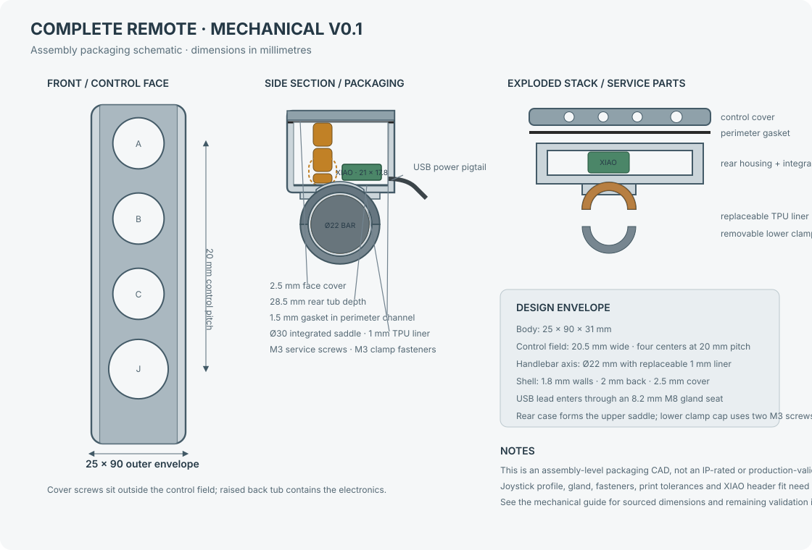

# Complete Mechanical CAD — V0.1

This is the first assembly-level mechanical design of the remote. It includes the control face, front cover, rear electronics tub, internal XIAO tray, cable entry, perimeter seal, handlebar saddle, split clamp, and a replaceable liner. The earlier `control-carrier-v0.2.scad` is only a control-layout study; use the complete assembly file below as the current mechanical starting point.

**Parametric assembly:** [complete-remote-v0.1.scad](../mechanical/cad/complete-remote-v0.1.scad)

The source is a parametric OpenSCAD assembly. It builds the complete body and mounting parts, with a translucent nominal handlebar reference and component packaging envelopes. Set `show_internals = false` for the closed outer assembly. Set `part_to_render` to `"cover"`, `"housing"`, `"clamp_lower"`, `"liner_upper"`, or `"liner_lower"` to export individual printable parts. The SVG above is a dimensioned packaging schematic, not a photorealistic render; the editable geometry is the SCAD file. Switches and board are envelopes, not manufacturer STEP solids.

## Assembly parts represented

1. **Front cover:** A/B/C button openings, joystick opening, and four service screw holes.
2. **Rear housing:** hollow tub, internal screw bosses, perimeter gasket channel, and cable entry.
3. **Electronics support:** XIAO tray with retaining rails; the board is placed behind the controls in a separate depth layer.
4. **Handlebar support:** integrated upper saddle and removable lower half-clamp sized around a nominal 22 mm bar, with separate TPU liner halves.
5. **Hardware envelopes:** cover screws and lower clamp fasteners.

## Sourced dimensions and design targets

| Feature | CAD value | Basis |
|---|---:|---|
| XIAO nRF52840 board outline | 21 × 17.8 mm | Seeed Studio published dimensions |
| APEM IS button panel opening | Ø13.6 mm | APEM IS series drawing |
| APEM reduced bezel option | 15 mm | APEM IS series options; confirm exact ordered variant |
| MHS joystick thread / panel | M16 × 1 / 2–3 mm | Ruffy Controls MHS datasheet |
| MHS nominal panel opening | Ø15.80 mm | Ruffy drawing callout Ø0.622 in; full profile needs confirmation |
| Handlebar | Ø22 mm nominal | Project target; measure the actual straight section |
| Body envelope | 25 × 90 × 31 mm | CAD packaging target (28.5 mm tub + 2.5 mm cover) |
| Case wall / rear floor / cover | 1.8 / 2.0 / 2.5 mm | Initial print design targets |
| Clamp bore and liner | Ø24 mm bore + 1 mm radial liner = Ø22 mm | Parametric design target; tune to measured bar and print process |
| Cable gland seat | Ø8.2 mm pass-through, Ø14 × 5 mm inner reinforcement | M8 gland packaging target; verify selected product drawing |
| USB cable jacket | 3–5 mm range candidate | Hummel M8 gland example; measure actual cable |
| XIAO header projection | 6 mm | Packaging allowance for the pre-soldered version; measure the bought board |

Seeed lists the XIAO board at 21 × 17.8 mm and provides a [2D DXF drawing](https://wiki.seeedstudio.com/XIAO_BLE/). The purchased variant has pre-soldered headers, so the model allocates 6 mm for their projection and places the PCB on edge rails behind the switch envelopes. That 6 mm is a packaging allowance, not a supplier dimension. The [Kiwi listing](https://www.kiwi-electronics.com/en/seeed-studio-xiao-nrf52840-pre-soldered-20402) confirms the headers are pre-soldered; measure their actual projection before printing. The 28.5 mm tub depth is the current packaging stack: 13.5 mm joystick depth + 2 mm control gap + 2 mm component height + 1.6 mm PCB + 6 mm headers + 1.4 mm rear clearance + 2 mm back wall.

The Ruffy [MHS datasheet](https://www.farnell.com/datasheets/4534112.pdf) specifies an M16 × 1 body, panel thickness 2–3 mm, and a nominal Ø0.622 in mounting callout. The drawing also contains a 0.291 in profile dimension and two rounded corners; V0.1 models the nominal circle only. Do not use the joystick opening as a finished drilling template until the complete profile is checked against the full drawing or the actual part.

APEM's [IS series page](https://www.apem.com/panel-switches/pushbutton-switches/is) gives the Ø13.6 mm panel cutout, 13 mm behind-panel depth, 1.5–4 mm panel range, and 15 mm reduced-bezel option. Order-code availability and the reduced-bezel variant's exact drawing must be confirmed before selecting the production switch.

## Power cable and service access

The model assumes a flexible USB supply lead from the bike's 5 V USB outlet enters through an M8 cable gland at the lower end of the enclosure. Its 5 V and ground connect to the XIAO; its USB plug remains outside for the bike's outlet. The design uses an Ø8.2 mm gland pass-through and a 5 mm long internal reinforcement seat. [Hummel's M8 × 1.25 gland example](https://www.hummel.com/en/product-finder-cable-gland/products/metal-cable-glands/hsk-mini/1106080055-wadi-a-fpm-m8x1-25/) accepts 3–5 mm cable; choose a gland only after measuring the actual cable jacket and checking its drawing. The internal lead path is represented as a bent cable envelope to the XIAO.

Four M3 cover screws provide access to the board and wiring for development and repair. Each screw has a shallow annular seal-groove target; the elastomer washer and clamp insert still need exact part selection. The XIAO USB-C connector is inside the enclosure in this arrangement; this CAD does not yet define a sealed external programming port. The product requirement for phone-based BLE firmware updates remains a firmware task.

## What is still required before fabrication

- Confirm button and joystick exact order codes and use the full supplier drawings or measured samples to model their bodies, nuts, terminals, leads, and complete panel cutouts.
- Measure the purchased XIAO including header projection, USB-C connector, component heights, and antenna keepout; verify the edge rails and cable route against the actual board.
- Measure the bike's straight 22 mm handlebar section. Verify the liner, clamp installation direction, steering clearance, and control interference on the motorcycle.
- Choose the actual cable gland, gasket material/cord, screw seals, and M3 clamp inserts; update their CAD seats to those parts.
- Check printed-part tolerances, wall strength, fastener pull-out, glove reach, water ingress, vibration, and impact on physical prototypes. Printed material and a gasket channel alone do not establish an IP rating.

The model is therefore a **complete packaging CAD**, not yet a manufacturing release. Dimensions marked as sourced come from the linked supplier references; the enclosure, cable, clamp, gasket, and hardware dimensions are explicit design targets for measurement and prototype revision.
