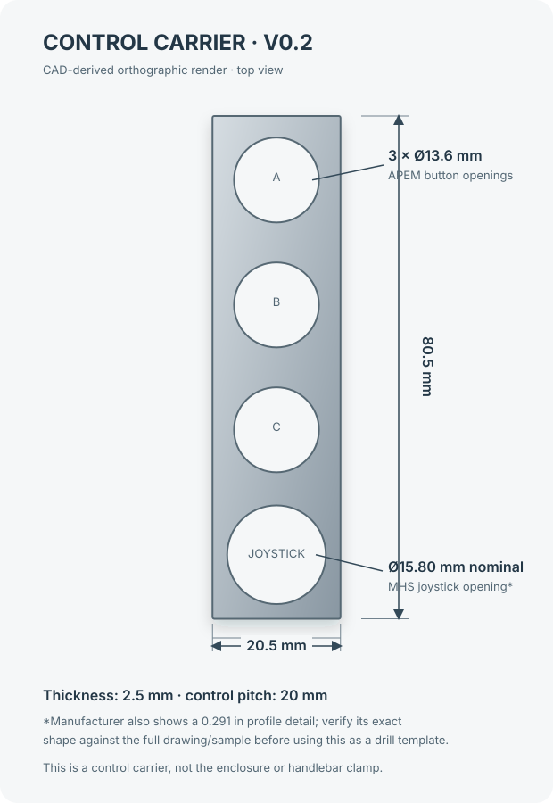

# Mechanical CAD — Control Carrier V0.2

The CAD now places the three APEM buttons and the five-way joystick on one narrow control carrier. Its 20.5 mm width is 3 mm less than the first plate: it uses APEM's reduced 15 mm bezel option and a 2.75 mm side margin. The joystick is the Ruffy Controls MHS-5-1 reference, with the center-press version shown as the default.

**CAD source:** [control-carrier-v0.2.scad](../mechanical/cad/control-carrier-v0.2.scad)

## Dimensions used

| Feature | Dimension | Basis |
|---|---:|---|
| Switch panel cutout | Ø13.6 mm | APEM IS series specification |
| Switch bezel | 15 mm | APEM IS reduced-bezel option |
| Button center spacing | 20 mm | APEM IS standard matrix spacing |
| Switch rear depth | 13 mm | APEM IS series specification; keepout reference |
| Joystick thread | M16 × 1 mm | Ruffy Controls MHS series |
| Joystick nominal opening | Ø15.80 mm | Ruffy MHS panel-cutout drawing: Ø0.622 in |
| Joystick panel thickness | 2–3 mm | Ruffy Controls MHS series |
| Carrier thickness | 2.5 mm | Within both APEM (1.5–4 mm) and Ruffy MHS (2–3 mm) ranges |
| Carrier outline | 20.5 × 80.5 mm | 15 mm bezel, 2.75 mm side/end margins, four positions at 20 mm pitch |

The button centers A, B, and C are followed by the joystick center, all on 20 mm pitch. The 2.75 mm margin comes from the selected 20.5 mm width and 15 mm bezel; it is not a manufacturer requirement. The joystick datasheet drawing also includes a 0.291 in (7.39 mm) profile detail with two rounded corners. Its exact shape cannot be established from the available text extraction, so V0.2 models the published Ø15.80 mm nominal opening only. Confirm the full profile against the original drawing or a physical sample before using the file as a drill template.

## Component reference

APEM's [IS series](https://www.apem.com/panel-switches/pushbutton-switches/is) provides the button dimensions and offers a reduced 15 mm bezel. Confirm the exact order code and the dimensional drawing for the selected reduced-bezel variant before buying. The manufacturer lists IP67 sealing and a 1,000,000-cycle mechanical life for the series.

Ruffy Controls' [MHS-5-1 datasheet](https://www.farnell.com/datasheets/4534112.pdf) describes a five-way joystick with a top press, M16 × 1 mounting, IP67 above-panel sealing, and a 2–3 mm panel range. The part is a dimensional reference, not a final cost selection; it is expensive for the project's low-cost goal. The centerless four-way MHS variant can be considered later if its exact mounting geometry matches.

## Scope and next CAD inputs

This carrier is not the final enclosure, cable entry, PCB carrier, or handlebar clamp. Those features depend on selected components and physical fit constraints. The next CAD revision needs:

- confirmation of the complete MHS opening profile, or a selected lower-cost joystick and its exact mounting drawing;
- the actual usable 22 mm handlebar section and available length at the intended position;
- the selected PCB, connector, cable gland, and their measured clearances.

Treat this as a first fit-check part only. It does not establish water resistance, impact resistance, glove usability, or road suitability; those require the complete assembly and physical testing.
