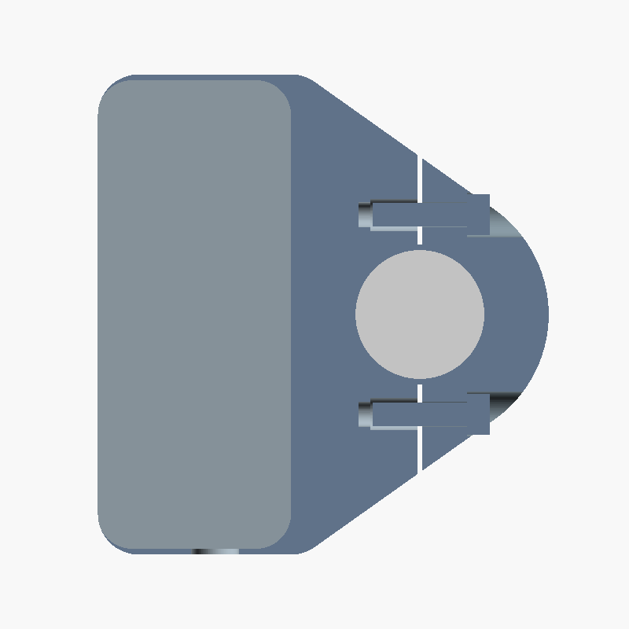
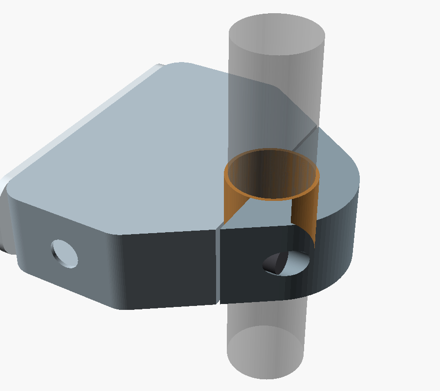
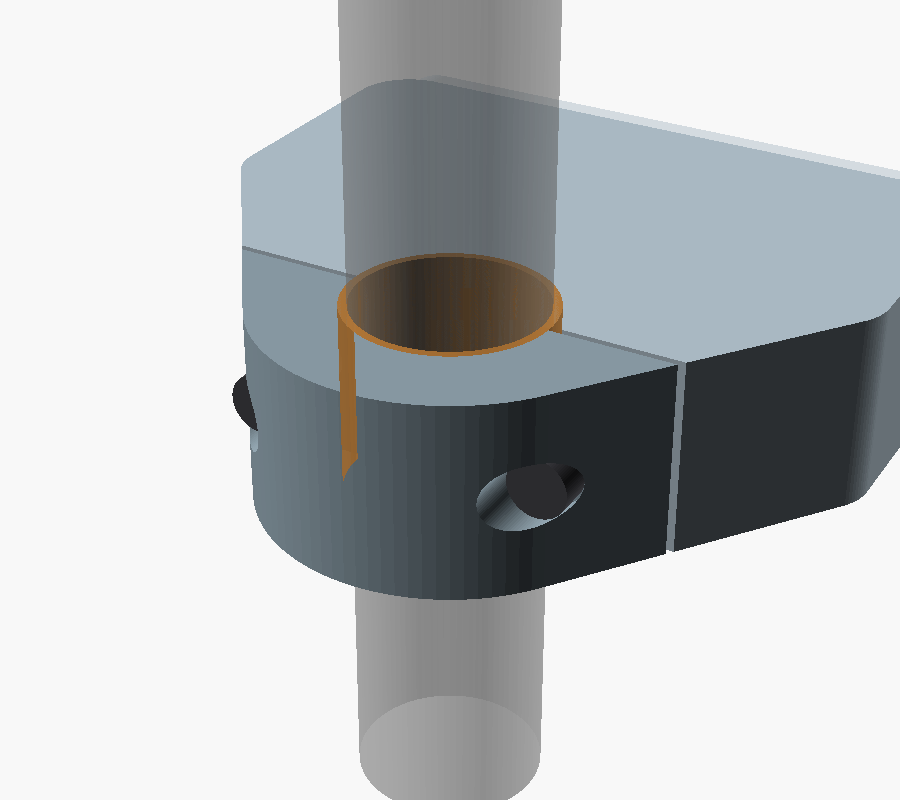

# Complete Mechanical CAD — V0.18 NAVCOMM-Referenced Concept

V0.18 keeps the V0.17 outer silhouette: the convex hull of the rounded pod outline and the Ø44 mm clamp circle, whose straight upper and lower edges run tangentially from the pod end corners to the clamp ring. The clamp split is now diametral. The plane through the handlebar axis, perpendicular to the pod-to-bar direction, divides the silhouette into the integrated body (pod side) and the rear clamp cap. Each half wraps 180° of the bar, less a 0.8 mm clamping gap between the faces, so the handlebar can enter the body from the rear and the cap closes behind it.

V0.17 could not be installed: its fixed body wrapped 250° of the bar, which left an opening of only 19.7 mm in front of the Ø24 mm lined bore. A 2D check sweeps the Ø24 mm bar-and-liner envelope out of its seat along the open direction: it clears the V0.18 body and collides with the V0.17 body.

Two M4 × 16 ISO 4762 socket-head bolts close the clamp. They run parallel to each other, perpendicular to the split faces, at 17 mm either side of the bar axis and at mid-width along the bar. The heads seat 8 mm behind the split face in counterbores in the rear cap, giving 7.6 mm of clamped cap material. The threads engage M4 heat-set inserts (Ø5.6 × 8.1 mm hole, plus 2 mm tip clearance) in the solid body shoulders, giving 7.6 mm of engagement. The wall between each bolt hole and the bore is 2.85 mm. Assertions stop the render if the bolt is longer than the insert hole or if that wall drops below 2 mm. The insert hole size is a common target; check it against the datasheet of the insert actually bought. The outer clamp diameter is Ø44 mm around a Ø24 mm lined bore, giving a 10 mm radial section; this is a packaging comparison only and has not been strength-validated.

**Current parametric concept:** [complete-remote-v0.18.scad](../mechanical/cad/complete-remote-v0.18.scad)

All three images are direct OpenSCAD renders of the V0.18 file. The bolt counterbores break out through the sloped rear flanks of the cap; the hex key approaches along the bolt axis from behind the bar. The shoulder regions between the diagonals and the ring are solid and carry the inserts; they add print time and material, so coring the area away from the inserts remains an open option.

The OpenSCAD file builds the integrated main body, rounded internal pod cavity, rear clamp cap, clamp bolts, rounded perforated control face, exposed control heads, split liner, and internal component envelopes. It opens in `assembly` mode. Set `part_to_render = "section"` to cut away half the axial width through the bolt axes, or `"cutaway"` to remove the face cover without sectioning. Set `show_internals = true` to show the switch and XIAO envelopes. The console reports the cavity envelope, clamp radial section, bolt grip, insert engagement, and bolt-to-bore wall. Set `part_to_render` to `"housing"`, `"clamp_cap"`, `"cover"`, `"liner_main"`, or `"liner_cap"` to inspect individual parts. Button heads and joystick knob are placeholders pending exact supplier parts.

## NAVCOMM reference

The [NAVCOMM product page](https://hesaparts.com/product/navcomm/) is the project's stated reference. Its [official user manual](https://hesaparts.com/wp-content/uploads/2025/02/EN/NAVCOMM%20USER%20MANUAL.pdf) specifies a 22 mm handlebar, at least 23 mm of space between the grip and the motorcycle's switchgear, rotation of the unit to suit the rider's reach, and fixing with two M4 screws and a flange. The control arrangement is one function button, two function/zoom buttons, and a lower four-way joystick.

V0.8 follows those functional and packaging cues while keeping original geometry. The CAD uses 23 mm as the target width along the bar, matching the manual's minimum installation gap; the manual does not publish the NAVCOMM's own overall width. Two parallel M4 bolts on either side of the bar close the rear clamp cap. The side panel keeps button presses perpendicular to the bar and can rotate around the bar before tightening.

## Assembly parts represented

1. **Integrated main body:** the pod side of the hull-defined silhouette, including a 180-degree clamp half and the solid shoulders that hold the M4 heat-set inserts. The straight upper and lower edges run tangentially from the pod end corners to the clamp ring; test printed strength and fit.
2. **Rear clamp cap:** the rear half of the silhouette, 180 degrees around the bar, continuing the diagonal edges. Two M4 × 16 socket-head bolts pass through Ø4.3 mm clearance holes and Ø7.6 mm counterbores into heat-set inserts in the body. A 0.8 mm gap between the split faces lets the bolts clamp the liner. Verify insert hole size, bolt length, clamping force, and cap strength in a prototype.
3. **Radial control face:** A/B/C and joystick openings are on the pod's side face. Their actuation axes are perpendicular to the handlebar axis.
4. **Electronics pod:** the XIAO is turned 90 degrees behind the control bodies inside the pod; a preliminary cable entry is included at the lower end.
5. **Replaceable liner:** two semicircular TPU pieces fit between the Ø24 mm clamp bore and nominal Ø22 mm handlebar.

## Sourced dimensions and design targets

| Feature | CAD value | Basis |
|---|---:|---|
| XIAO nRF52840 board outline | 21 × 17.8 mm | Seeed Studio published dimensions |
| APEM IS button panel opening | Ø13.6 mm | APEM IS series drawing |
| APEM reduced bezel option | 15 mm | APEM IS series options; confirm exact ordered variant |
| MHS joystick thread / panel | M16 × 1 / 2–3 mm | Ruffy Controls MHS datasheet |
| MHS nominal panel opening | Ø15.80 mm | Ruffy drawing callout Ø0.622 in; full profile needs confirmation |
| Handlebar | Ø22 mm nominal | Project target; measure the actual straight section |
| Integrated clamp | Ø44 mm outer diameter, Ø24 mm bore | Comparison target; diametral split into two 180-degree halves with a 0.8 mm clamping gap |
| Clamp radial section | 10 mm | Derived from Ø44 mm outer diameter and Ø24 mm bore; compare structurally against the earlier 13 mm section |
| Pod-to-clamp shoulders | Tangent lines from the 7 mm pod end corners to the Ø44 mm ring, meeting it at 54.6° from the rear axis; the rear cap carries the outer end of each diagonal | Convex hull of pod outline and clamp circle, following the marked silhouette; confirm strength and print orientation by physical testing |
| Control-cover end corners | 7 mm radius | Matched to the pod outline corner radius |
| Pod cavity end corners | 6 mm radius | 1 mm inset from the 7 mm outer pod radius |
| Clamp liner | 1 mm radial TPU liner gives Ø22 mm nominal inner diameter | Parametric target; tune to measured bar and print process |
| Enclosure envelope | About 80 × 82 mm around the control face; 23 mm along the bar | Current concept target informed by the manual's 23 mm installation clearance; verify on the bike |
| Button direction | Button axes perpendicular to the handlebar axis | Layout requirement; reflected in V0.3 coordinate system |
| Case wall / cover | 1.0 / 2.5 mm | Compact prototype target; assess wall strength and print process |
| Control pitch | 18 mm, four controls | Layout target; confirm glove access and supplier bezel sizes |
| Clamp fasteners | Two parallel M4 × 16 ISO 4762 bolts at ±17 mm from the bar axis; Ø7.6 mm counterbores 8 mm from the split face; Ø5.6 × 8.1 mm heat-set insert holes | Initial targets; 7.6 mm grip, 7.6 mm engagement, 2.85 mm wall to bore; confirm against the bought bolts and inserts |
| Joystick body envelope | Ø20.1 mm MHS candidate | Supplier drawing target; leaves only 0.9 mm total axial clearance inside the 21 mm cavity before tolerances |
| Cable entry | Ø8.2 mm preliminary pass-through; gland seat not modeled yet | Initial layout only; verify after selecting the gland and cable |
| USB cable jacket | 3–5 mm range candidate | Hummel M8 gland example; measure actual cable |
| XIAO header projection | 6 mm | Packaging allowance for the pre-soldered version; measure the bought board |

Seeed lists the XIAO board at 21 × 17.8 mm and provides a [2D DXF drawing](https://wiki.seeedstudio.com/XIAO_BLE/). The purchased variant has pre-soldered headers; V0.4 places the board parallel to the radial control cover, behind the button bodies. The 6 mm header projection is an allowance, not a supplier dimension. The [Kiwi listing](https://www.kiwi-electronics.com/en/seeed-studio-xiao-nrf52840-pre-soldered-20402) confirms the headers are pre-soldered. Check the actual header, USB-C, antenna, and component clearances against the printed cavity before finalizing it.

The Ruffy [MHS datasheet](https://www.farnell.com/datasheets/4534112.pdf) specifies an M16 × 1 body, panel thickness 2–3 mm, and a nominal Ø0.622 in mounting callout. The drawing also contains a 0.291 in profile dimension and two rounded corners; V0.5 still models the nominal circle only. Its Ø20.1 mm body envelope nearly fills the axial cavity needed for the 23 mm package. Confirm the real joystick and print tolerance; this candidate may need replacement with a narrower part to preserve the compact width and a robust housing wall.

APEM's [IS series page](https://www.apem.com/panel-switches/pushbutton-switches/is) gives the Ø13.6 mm panel cutout, 13 mm behind-panel depth, 1.5–4 mm panel range, and 15 mm reduced-bezel option. Order-code availability and the reduced-bezel variant's exact drawing must be confirmed before selecting the production switch.

## Power cable and service access

The model includes a preliminary Ø8.2 mm cable entry through the lower end wall of the pod. It does not yet model a selected gland, its nut/seat, strain relief, or the complete wire route. One candidate is [Hummel's M8 × 1.25 gland](https://www.hummel.com/en/product-finder-cable-gland/products/metal-cable-glands/hsk-mini/1106080055-wadi-a-fpm-m8x1-25/), listed for 3–5 mm cable; select and measure the actual cable and gland before adding their mounting features to the CAD.

The clamp fastener seats are preliminary M4 targets; the cover still lacks its final service-screw seats and sealing features. The XIAO USB-C connector is inside the enclosure in this arrangement; the CAD does not yet define a sealed external programming port. Phone-based BLE firmware updates remain a firmware requirement.

## What is still required before fabrication

- Confirm button and joystick exact order codes and use the full supplier drawings or measured samples to model their bodies, nuts, terminals, leads, and complete panel cutouts.
- Measure the purchased XIAO including header projection, USB-C connector, component heights, and antenna keepout; verify the rotated board fit, pod cavity, and cable route against the actual board.
- Measure the bike's straight 22 mm handlebar section. Verify the liner, clamp installation direction, steering clearance, and control interference on the motorcycle.
- Print and load-test the split-ring body, cap, insert seats, and liner. This CAD expresses the integrated architecture but does not establish fatigue or impact strength without physical testing.
- Choose the actual cable gland, cover seal, clamp bolts/nuts or inserts, and service fasteners; add their seats and access to the CAD.
- Check printed-part tolerances, wall strength, fastener pull-out, glove reach, water ingress, vibration, and impact on physical prototypes. This concept does not establish an IP rating.

This is a **full-form CAD concept**, not yet a manufacturing release. Dimensions marked as sourced come from the linked supplier references; the enclosure, cable, clamp, control-head, and fastener dimensions are initial design targets for measurement and prototype revision. The reduced 10 mm clamp section and filled shoulders are packaging concepts, not strength-proven parts. V0.1–V0.17 remain available as earlier layouts for comparison. V0.17 should not be printed: its 250-degree body cannot pass the handlebar. V0.13–V0.16 are superseded attempts at the shoulder silhouette and should not be printed: V0.13 left gaps at the shoulders, V0.14 dropped most of the pod through an incorrectly closed polygon, and in V0.15 and V0.16 the same polygon traced the clamp arc as an inner boundary, so the fixed 250-degree ring was missing and only the removable cap surrounded the bar.
