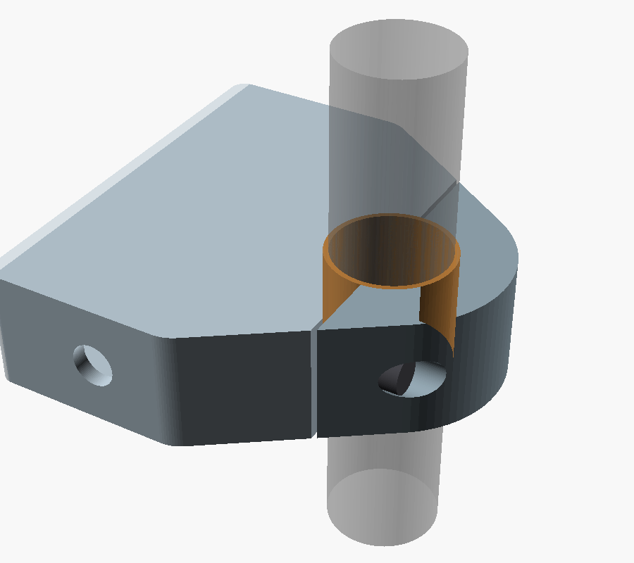
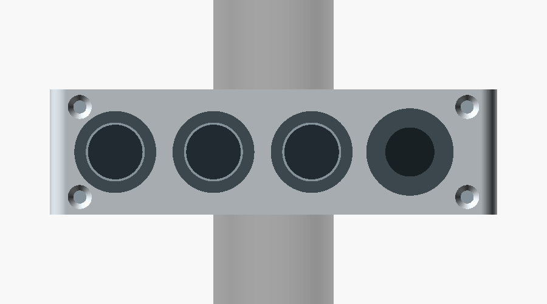
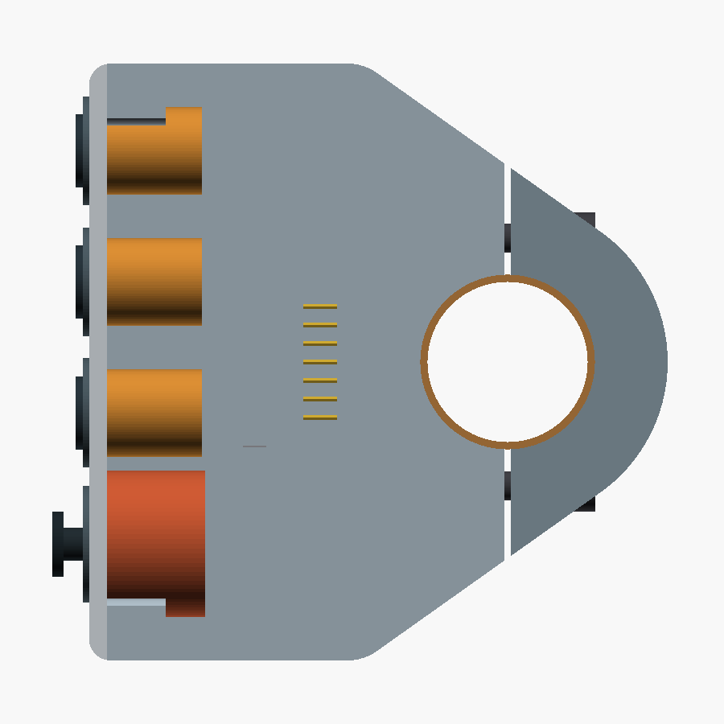
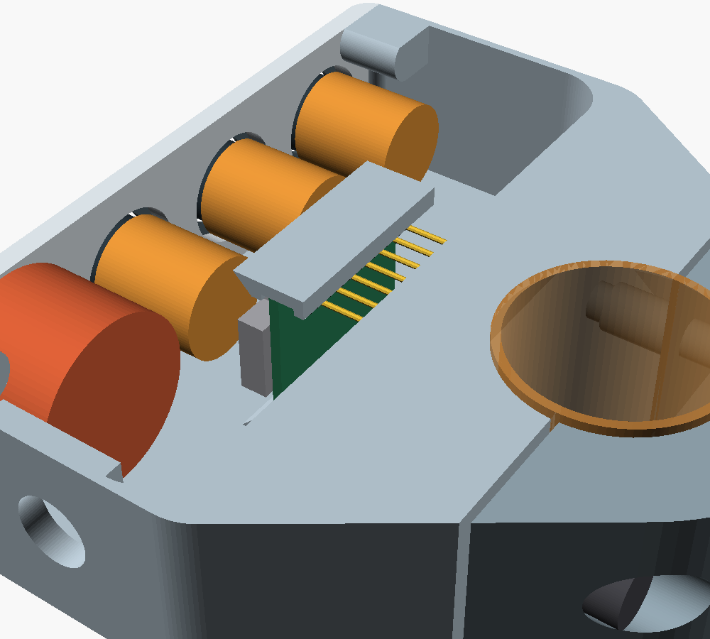
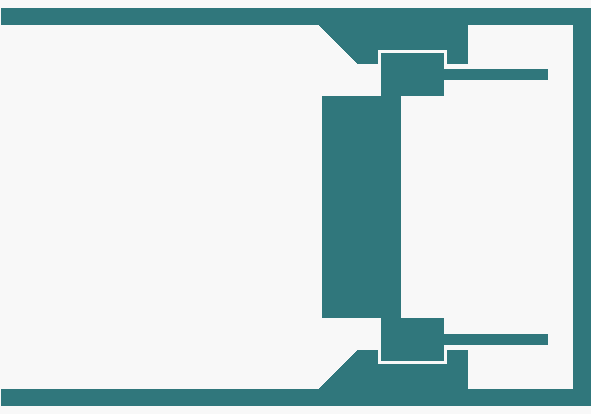

# Complete Mechanical CAD — V0.19 Print-Ready Concept

V0.19 completes the V0.18 housing for a first print. All three printed housing parts are slices of one outer silhouette, so they match each other exactly. The silhouette is the convex hull of the pod outline and the Ø44 mm clamp circle, extruded 23 mm along the bar. Two planes normal to the pod-to-bar direction cut it into the control cover, the housing, and the rear clamp cap. Supplier and purchase unknowns remain open and are listed at the end; they are marked `MEASURE` in the CAD.

**Current parametric concept:** [complete-remote-v0.19.scad](../mechanical/cad/complete-remote-v0.19.scad)

All images are direct OpenSCAD renders of the V0.19 file.

## Changes from V0.18

- **Control cover matches the box.** The cover is now the front 2.5 mm slice of the silhouette instead of a separate rounded plate. Its outline follows the pod corners in the plane of the clamp, and its long edges are square like the rest of the extruded housing. The pod front corners are reduced from 7 mm to 3 mm radius so the cover keeps a flat face for its corner screws; the rear corners keep 7 mm, so the diagonals to the clamp are unchanged.
- **Cover fastening.** Four M2 × 6 ISO 10642 countersunk screws pass through the cover into M2 heat-set inserts. The inserts sit in Ø6 mm bosses, 8 mm deep, joined to the end walls and to the axial walls at Y = ±35.5 mm, Z = 3.25 mm and 19.75 mm.
- **Controls recentred.** The 18 mm pitch is kept; the controls move 2 mm toward the top end (Y = 29, 11, −7, −25 mm). The joystick now keeps 4.95 mm to the bottom end wall instead of touching the cavity corner, which V0.18 did.
- **XIAO mounting.** Two rails on the axial walls hold the board's long edges together with the header spacer. The board slides in along +Y from the free space below the rails and stops against the closed +Y end. Its component side and USB-C face the controls; the header pins point to the rear wall.
- **Cable gland boss.** The bottom end wall is 3 mm thick over a 14 mm wide area around the Ø8.2 mm cable hole, as a seat for an M8 gland and its nut.
- **Print orientations.** `print_housing`, `print_cap`, and `print_cover` export each part in its print orientation.

## Interior space check

The OpenSCAD console reports these values; the boolean checks below were run on the rendered meshes.

| Check | Result |
|---|---|
| Pod cavity | 33.1 × 80 × 21 mm |
| Control bodies vs housing and cover | No overlap |
| XIAO envelope vs housing | No overlap in place, and none along a 22 mm slide-in path |
| Wiring space between control rear ends and XIAO component side | 5.0 mm |
| XIAO pin tips to cavity rear wall | 1.4 mm |
| Joystick body clearance | 0.45 mm per side along the bar; 4.95 mm to the bottom end wall |
| USB-C plug (12 × 6.5 × 25 mm overmold) plugged into the XIAO with the cover off | Clear of the housing |
| Cover screws vs control bodies | No overlap |
| Bar and liner (Ø24 mm) leaving the body toward the cap side | Clear |
| Each printed part | One closed solid |

The electronics fit with the current envelopes. The tightest points are the joystick width, the 5 mm wiring space, and the 1.4 mm behind the header pins. All three depend on parts that still have to be measured.

## Printing

| Part | Mode | Orientation | Material (suggested) |
|---|---|---|---|
| Housing | `print_housing` | Front face on the bed | PETG or ASA |
| Clamp cap | `print_cap` | Axial face on the bed | PETG or ASA |
| Control cover | `print_cover` | Outer face on the bed | PETG or ASA |
| Liners ×2 | `liner_main`, `liner_cap` | Axial face on the bed | TPU 95A |

No part needs supports. On the housing, the clamp half and the shoulders narrow upward. The cavity's rear wall bridges 21 mm, and the XIAO rails have 45° chamfers. The housing stands on its thin front rim, so use a brim. The 1 mm walls need at least two perimeters with a 0.4 mm nozzle. Use 100% infill or at least four perimeters around the M4 insert holes.

## Assembly

1. Press the two M4 inserts into the housing split face and the four M2 inserts into the cover bosses with a soldering iron.
2. Mount the three buttons and the joystick in the cover.
3. Solder the control wires to the XIAO pins on the component side. Pass the power cable through the gland, and solder its wires to the XIAO 5V and GND pins. The USB-C plug cannot pass through an M8 gland.
4. Slide the XIAO into the rails along +Y until it stops. Secure its free end with a drop of hot glue or silicone.
5. Fit the cover with four M2 × 6 countersunk screws.
6. Fit the liner halves, place the housing on the bar, fit the cap from behind, and tighten the two M4 × 16 bolts evenly.

To program over USB, remove the cover. The USB-C socket is on the component side at the lower end of the board and opens toward the bottom of the pod; a plug fits there with the cover off. BLE firmware updates remain a firmware requirement.

## Hardware

| Item | Qty |
|---|---:|
| M4 × 16 ISO 4762 socket-head screw | 2 |
| M4 heat-set insert, short (hole Ø5.6 × 8.1 mm in CAD) | 2 |
| M2 × 6 ISO 10642 countersunk screw | 4 |
| M2 heat-set insert (hole Ø3.2 × 5 mm in CAD) | 4 |
| M8 × 1.25 cable gland for 3–5 mm cable | 1 |

## NAVCOMM reference

The [NAVCOMM product page](https://hesaparts.com/product/navcomm/) is the project's stated reference. Its [official user manual](https://hesaparts.com/wp-content/uploads/2025/02/EN/NAVCOMM%20USER%20MANUAL.pdf) specifies a 22 mm handlebar, at least 23 mm of space between the grip and the motorcycle's switchgear, rotation of the unit to suit the rider's reach, and fixing with two M4 screws and a flange. The control arrangement is one function button, two function/zoom buttons, and a lower four-way joystick.

V0.8 follows those functional and packaging cues while keeping original geometry. The CAD uses 23 mm as the target width along the bar, matching the manual's minimum installation gap; the manual does not publish the NAVCOMM's own overall width. Two parallel M4 bolts on either side of the bar close the rear clamp cap; four M2 screws hold the control cover. The side panel keeps button presses perpendicular to the bar and can rotate around the bar before tightening.

## Sourced dimensions and design targets

| Feature | CAD value | Basis |
|---|---:|---|
| XIAO nRF52840 board outline | 21 × 17.8 mm | Seeed Studio published dimensions |
| APEM IS button panel opening | Ø13.6 mm | APEM IS series drawing |
| APEM reduced bezel option | 15 mm | APEM IS series options; confirm exact ordered variant |
| MHS joystick thread / panel | M16 × 1 / 2–3 mm | Ruffy Controls MHS datasheet |
| MHS nominal panel opening | Ø15.80 mm | Ruffy drawing callout Ø0.622 in; full profile needs confirmation |
| Handlebar | Ø22 mm nominal | Project target; measure the actual straight section |
| Integrated clamp | Ø44 mm outer diameter, Ø24 mm bore | Diametral split into two 180-degree halves with a 0.8 mm clamping gap |
| Clamp radial section | 10 mm | Derived from Ø44 mm outer diameter and Ø24 mm bore; not strength-validated |
| Pod-to-clamp shoulders | Tangent lines from the 7 mm rear pod corners to the Ø44 mm ring | Convex hull of pod outline and clamp circle, following the marked silhouette |
| Pod front corners | 3 mm radius | Leaves a flat cover face for the M2 screws |
| Pod cavity corners | 2 mm front, 6 mm rear | 1 mm inset from the outer corners |
| Clamp liner | 1 mm radial TPU liner gives Ø22 mm nominal inner diameter | Parametric target; tune to measured bar and print process |
| Enclosure envelope | 79.5 × 82 mm in the plane of the clamp; 23 mm along the bar | Informed by the manual's 23 mm installation clearance; verify on the bike |
| Button direction | Button axes perpendicular to the handlebar axis | Layout requirement |
| Case wall / cover | 1.0 / 2.5 mm | Wall limited by the 20.1 mm joystick candidate; cover within both switch panel ranges |
| Control pitch | 18 mm, four controls at Y = 29, 11, −7, −25 mm | Layout target; confirm glove access and supplier bezel sizes |
| Clamp fasteners | Two parallel M4 × 16 ISO 4762 bolts at ±17 mm from the bar axis; Ø7.6 mm counterbores 8 mm from the split face; Ø5.6 × 8.1 mm insert holes | 7.6 mm grip, 7.6 mm engagement, 2.85 mm wall to bore; confirm against the bought bolts and inserts |
| Cover fasteners | Four M2 × 6 ISO 10642 countersunk screws; Ø3.2 × 5 mm insert holes in Ø6 mm bosses | Initial targets; confirm against the bought inserts |
| Joystick body envelope | Ø20.1 mm MHS candidate | Supplier drawing target; 0.45 mm per side inside the 21 mm cavity |
| Cable entry | Ø8.2 mm hole in a 3 mm wall | Seat for an M8 gland; verify after selecting the gland and cable |
| USB cable jacket | 3–5 mm range candidate | Hummel M8 gland example; measure actual cable |
| XIAO PCB / header spacer / pins | 1.2 / 2.5 / 6 mm | Allowances for the pre-soldered version; measure the bought board |

Seeed lists the XIAO board at 21 × 17.8 mm and provides a [2D DXF drawing](https://wiki.seeedstudio.com/XIAO_BLE/). The purchased variant has pre-soldered headers; V0.19 keeps the board parallel to the control cover, behind the control bodies, with the header pins pointing away from the controls. The 2.5 mm spacer and 6 mm pin length are allowances, not supplier dimensions. The [Kiwi listing](https://www.kiwi-electronics.com/en/seeed-studio-xiao-nrf52840-pre-soldered-20402) confirms the headers are pre-soldered. Check the actual header, USB-C, antenna, and component clearances against the printed cavity before finalizing it.

The Ruffy [MHS datasheet](https://www.farnell.com/datasheets/4534112.pdf) specifies an M16 × 1 body, panel thickness 2–3 mm, and a nominal Ø0.622 in mounting callout. The drawing also contains a 0.291 in profile dimension and two rounded corners; V0.5 still models the nominal circle only. Its Ø20.1 mm body envelope nearly fills the axial cavity needed for the 23 mm package. Confirm the real joystick and print tolerance; this candidate may need replacement with a narrower part to preserve the compact width and a robust housing wall.

APEM's [IS series page](https://www.apem.com/panel-switches/pushbutton-switches/is) gives the Ø13.6 mm panel cutout, 13 mm behind-panel depth, 1.5–4 mm panel range, and 15 mm reduced-bezel option. Order-code availability and the reduced-bezel variant's exact drawing must be confirmed before selecting the production switch.

## Open unknowns before printing

These are the only items that block a confident first print. Each is a parameter in the CAD.

- **Switches and joystick:** exact order codes, nut sizes behind the panel, terminal length, and wire exit. The 5 mm wiring space and the cover bosses assume the 13 mm and 13.5 mm behind-panel envelopes with no larger nut. If a joystick nut behind the panel is wider than about 20 mm, it does not fit the 21 mm cavity.
- **XIAO:** PCB thickness, header spacer height, pin length, and component height. Adjust `xiao_pcb`, `xiao_header_plastic`, `xiao_pin_length`, and `xiao_component_h`; the render stops if the pins reach the rear wall.
- **Inserts:** hole diameters and depths for the actual M4 and M2 inserts.
- **Handlebar and liner:** measured bar diameter, and the 0.8 mm clamping gap tuned to the printed TPU liner.
- **Cable gland:** thread, nut size, and cable diameter.

Not addressed by this concept: water sealing (there is no gasket between cover and housing, and the 1 mm walls leave no room for one), IP rating, impact, vibration, and fatigue strength. These need physical testing.

## Earlier versions

V0.1–V0.18 remain available for comparison. V0.18 is installable but has a cover that does not match the housing and no cover, board, or gland mounting. V0.17 should not be printed: its 250-degree body cannot pass the handlebar. V0.13–V0.16 are superseded attempts at the shoulder silhouette and should not be printed: V0.13 left gaps at the shoulders, V0.14 dropped most of the pod through an incorrectly closed polygon, and in V0.15 and V0.16 the same polygon traced the clamp arc as an inner boundary, so the fixed 250-degree ring was missing and only the removable cap surrounded the bar.
