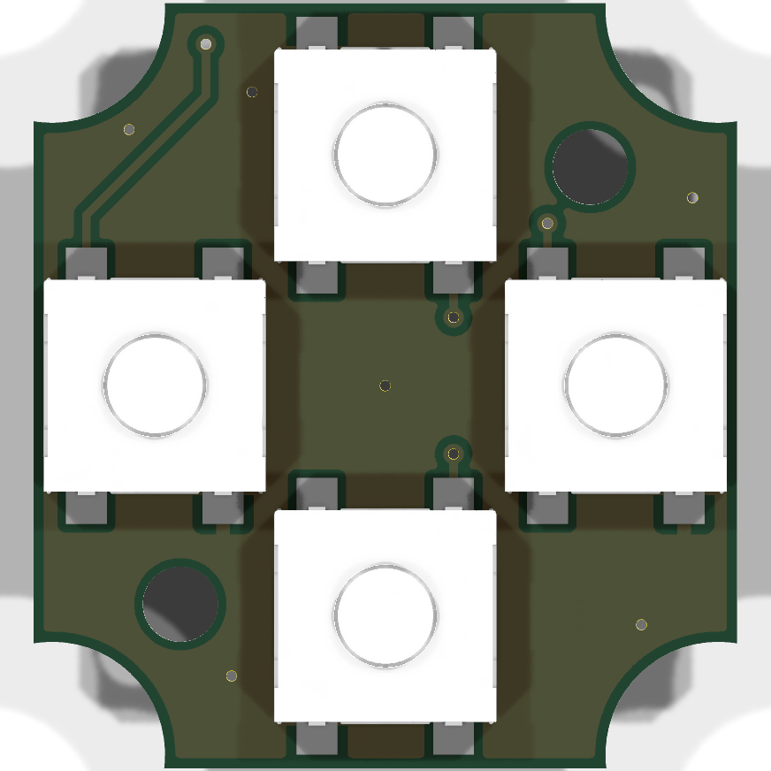
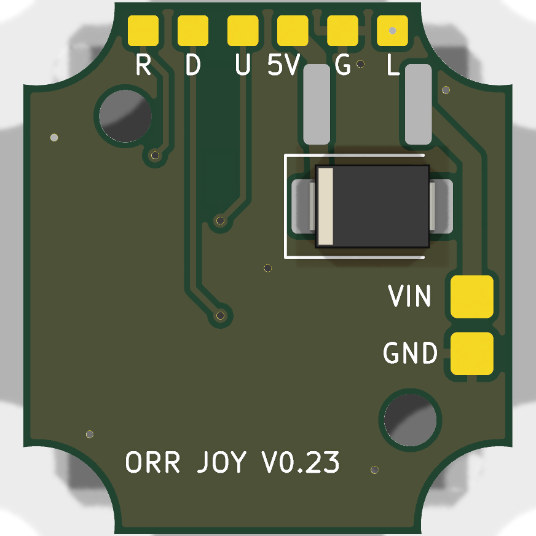
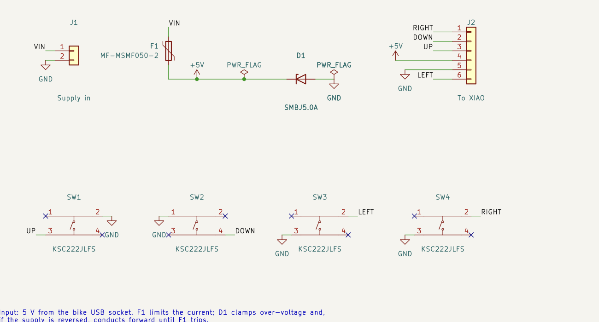

# Joystick PCB — V0.23

The joystick PCB carries the four C&K KSC2 switches under the stick's cross disc, and the 5 V input protection for the whole remote. It fits the V0.23 enclosure ([CAD](../../mechanical/cad/complete-remote-v0.23.scad), [notes](../../docs/mechanical-concept.md)).







Status: designed and checked in KiCad (ERC, DRC and schematic parity clean). Not yet built.

## Board

- Two layers, 1.6 mm FR-4, 1 oz copper. Ground pour on both sides.
- Outline 20.6 × 22.4 mm, with a 3.3 mm radius notch at each corner for the lower cover-screw bosses. The same numbers are in the CAD (`joy_pcb_hx`, `joy_pcb_hy`, `joy_pcb_notch_r`).
- Rules: 0.2 mm clearance, 0.25 mm signal tracks, 0.8 mm supply tracks, 0.6/0.3 mm vias, 0.3 mm copper to edge. These are within standard JLCPCB and PCBWay limits.
- Two Ø2.2 mm holes for M2 × 8 button-head screws into the joystick plate standoffs. The head must be no more than Ø3.5 × 1.1 mm (ISO 7380 style): a pan head touches a 12 mm wide USB-C plug in the XIAO when the cover is off.

Board coordinates are seen from the front (switch side, facing the cover). +x is the rider's right, +y is down the facet, away from button C.

## Circuit

| Net | Front | Rear |
|---|---|---|
| UP, DOWN, LEFT, RIGHT | One pad of each switch | Wire pads U, D, L, R to XIAO D3, D4, D5, D6 |
| GND | The diagonally opposite pad of each switch | Wire pad G to XIAO GND; input pad GND |
| VIN | — | Input pad VIN, through F1 |
| +5V | — | After F1; clamped by D1; wire pad 5V to the XIAO 5V pin |

- **Switches.** Each switch uses one diagonal pair of its four pads. Whether the part pairs pads 1-2 or 1-3 internally, a diagonal pair always spans the contact, so the internal pairing does not need to be confirmed. The other two pads are soldered but not connected.
- **Centre press.** There is no fifth switch. Pushing the stick straight in closes all four; the firmware reads the chord as the centre press (see the [firmware specification](../../docs/firmware-spec.md)).
- **F1.** Bourns MF-MSMF050-2, PTC resettable fuse, 1812: 0.5 A hold, 1 A trip, 15 V maximum.
- **D1.** Littelfuse SMBJ5.0A, unidirectional TVS, 600 W, 5.0 V stand-off. It clamps transients on the supply. If the supply is reversed, it conducts forward and F1 trips. The 15 V rating of F1 also covers a supply wired to 12 V by mistake; 6 V polyfuses, common in 1206, would not.
- The XIAO takes its supply from the 5V wire pad, not from the cable directly. In Seeed's XIAO nRF52840 V1.2 schematic (KiCad project dated 2026-08-28, from the Seeed wiki), the 5V header pin is the same net as the USB-C VBUS pins, with no diode or switch between them. The Schottky diode on the XIAO sits after that net, in front of its 3.3 V regulator. So the bike supply and a USB-C cable would be connected straight together, and each could feed current into the other. F1 limits that current to its 0.5 A hold rating, but that is still enough to stress a computer's USB port or the bike's socket. Do not connect USB-C while the bike supply is connected. The board revision bought may differ from V1.2; check its silkscreen.

## Placement against the enclosure

The CAD checks the PCB against the housing, cover, gasket, plate, stick, XIAO and USB-C plug:
- Front: the switch bodies and pads; the two standoffs clear the pads.
- Rear, everywhere: 1.0 mm for solder joints, vias and screw heads (1.1 mm).
- Rear, upper half (towards button C) and the two side strips |x| ≥ 6.3 mm: 3.0 mm. All rear parts and wire pads are in these zones. The lower middle stays low because a USB-C plug in the XIAO (cover off) passes close behind it.

Route the supply cable from the gland along the side wall to the VIN and GND pads, and the six XIAO wires from the top edge.

## Parts

| Ref | Part | LCSC | Side |
|---|---|---|---|
| SW1–SW4 | C&K KSC222JLFS, sealed tact switch, 2 N | C221728 | Front |
| F1 | Bourns MF-MSMF050-2 | C17313 | Rear |
| D1 | Littelfuse SMBJ5.0A | C83333 | Rear |
| J1, J2 | Wire pads (no part) | — | Rear |

The LCSC numbers were checked against the LCSC listings and the EasyEDA part data on 2026-10-10; stock and prices change.

The KSC2 land pattern comes from the LCSC/EasyEDA footprint for C221728. Its pads reach 0.95 mm beyond the body, so the joints can be reached with a fine iron tip or hot air.

## Fabrication files

`fab/` holds the outputs for the current board:
- `joystick-gerbers.zip` and `gerbers/`: copper, mask, paste, silkscreen, outline, and separate plated and non-plated Excellon drill files.
- `joystick-bom.csv`: grouped BOM with MPN and LCSC numbers.
- `joystick-pos.csv`: placement file (KiCad format, mm). JLCPCB expects its own column names and often needs rotation corrections for some parts; check the placement preview before ordering assembly.
- `joystick-schematic.pdf`.

Assembly on both sides costs more at most assembly services. Ordering assembly of the front (four switches) and hand-soldering F1 and D1 on the rear is the cheaper option; both are large parts.

## Regenerating

The board and schematic are generated by script, so the CAD numbers and the KiCad files stay in step. Edit `design.py` (placement, nets, routing), then run from this directory:

```
/Applications/KiCad/KiCad.app/Contents/Frameworks/Python.framework/Versions/Current/bin/python3 gen_pcb.py
```

`gen_pcb.py` writes `joystick.kicad_pcb` and calls `gen_sch.py` for `joystick.kicad_sch`. Then check and export:

```
K=/Applications/KiCad/KiCad.app/Contents/MacOS/kicad-cli
$K sch erc --severity-all joystick.kicad_sch
$K pcb drc --schematic-parity --severity-all joystick.kicad_pcb
$K pcb export gerbers --layers F.Cu,B.Cu,F.Paste,B.Paste,F.SilkS,B.SilkS,F.Mask,B.Mask,Edge.Cuts --subtract-soldermask -o fab/gerbers/ joystick.kicad_pcb
$K pcb export drill --format excellon --excellon-separate-th --generate-map --map-format gerberx2 -o fab/gerbers/ joystick.kicad_pcb
$K pcb export pos --format csv --units mm --side both --exclude-dnp -o fab/joystick-pos.csv joystick.kicad_pcb
$K sch export bom --fields 'Reference,Value,Footprint,Manufacturer,MPN,LCSC,${QUANTITY}' --labels 'Reference,Value,Footprint,Manufacturer,MPN,LCSC,Qty' --group-by 'Value,Footprint' --exclude-dnp -o fab/joystick-bom.csv joystick.kicad_sch
```

Tested with KiCad 10.0.6 on macOS. Run without a configured KiCad (no global library tables), ERC and DRC also report that the stock `Fuse`, `Diode_SMD` and symbol libraries are not configured; those warnings go away once KiCad has been opened once and has created its default tables.

The project tables (`fp-lib-table`, `sym-lib-table`) add the local `orr` library: the KSC2 footprint and 3D model, the wire-pad footprints, the standoff hole and the KSC222JLFS symbol.

## Open points

- Measure the switch height on the real parts: together with the printed plate, ball, disc and standoffs it sets the 0.05 mm rest gap under the disc.
- Decide whether to add a series Schottky diode after F1, so that USB-C can stay connected with the bike supply on. It would cost about 0.3–0.4 V at the XIAO, ahead of its own diode and regulator, and it needs a place on the rear of the board.
- Check the placement file rotations with the assembler's preview.
